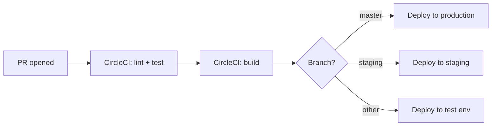

# Architecture — contentful/apps

## Overview

`contentful/apps` is a **Lerna + Nx monorepo** containing the source code for most first-party Contentful Marketplace apps, two shared base-library packages, and supporting scripts. Apps are built with **React + TypeScript + Vite** and deployed as Contentful App Framework apps.

```
contentful/apps/
├── apps/                        # 56 individual Contentful apps
│   ├── ai-content-generator/
│   ├── bulk-edit/
│   ├── jira/
│   └── ...
├── packages/                    # Shared libraries (published to npm)
│   ├── dam-app-base/            # @contentful/dam-app-base
│   ├── ecommerce-app-base/      # @contentful/ecommerce-app-base
│   └── eslint-plugin-contentful-apps/
├── examples/                    # Example apps for external developers
├── function-examples/           # App Functions examples
├── apps-migration-scripts/      # One-off data migration utilities
└── scripts/                     # Repo-level tooling scripts
```

---

## Monorepo Tooling

| Tool | Role |
|------|------|
| **Lerna 6** | Lifecycle orchestration — bootstrap, build, test, deploy, publish |
| **Nx** | Build caching (`build`, `test`, `lint` are cacheable operations) |
| **npm workspaces** | Not used — Lerna manages hoisting and dependency linking |
| **CircleCI** | CI/CD (`.circleci/config.yml`) |

Lerna is configured with `"version": "independent"` — each app/package has its own version. Releases are driven by Conventional Commits via `lerna version --conventional-commits`.

**Key Lerna flags used in scripts:**
- `--since master` / `--since HEAD^` — only run commands against changed packages
- `--include-dependencies` — always build/test deps of changed packages too
- `SINCE` env var is set per branch in CI (`HEAD^` on master/staging, `master` elsewhere)

---

## App Archetypes

### 1. Standard Vite App (majority)
Full TypeScript + React apps bundled with Vite. Self-contained under `apps/<name>/`.

```
apps/<name>/
├── src/
│   ├── index.tsx              # Mounts <App />
│   ├── App.tsx                # Routes sdk.location → component
│   ├── locations/             # One file per App Framework location
│   │   ├── ConfigScreen.tsx
│   │   ├── Sidebar.tsx
│   │   ├── Field.tsx
│   │   ├── Dialog.tsx
│   │   ├── Page.tsx
│   │   └── EntryEditor.tsx
│   ├── components/            # Shared UI within the app
│   ├── hooks/
│   ├── utils/
│   └── ...
├── package.json
├── vite.config.ts
├── tsconfig.json
└── index.html
```

Location routing pattern (every standard app follows this):
```tsx
const ComponentLocationSettings = {
  [locations.LOCATION_APP_CONFIG]: ConfigScreen,
  [locations.LOCATION_ENTRY_SIDEBAR]: Sidebar,
  // ...
};
```

### 2. App Actions + Frontend App
Apps that need server-side logic use **App Actions** (serverless functions run by Contentful). Structure:

```
apps/<name>/
├── frontend/                  # React app (same Vite pattern)
├── app-actions/               # App Action handlers (TypeScript)
├── contentful-app-manifest.json
├── build-actions.js
└── package.json
```

Examples: `mux`, `vercel`, `microsoft-teams`, `sap-commerce-cloud`

### 3. Lambda + Frontend App (legacy)
Older apps use AWS Lambda for backend logic instead of App Actions.

```
apps/<name>/
├── frontend/                  # React app
├── lambda/                    # AWS Lambda functions
└── package.json
```

Examples: `netlify`, `typeform`, `slack`, `sap-commerce-cloud-with-air`, `google-analytics-4`, `ai-image-tagging`, `smartling`

### 4. DAM / Ecommerce Base Apps
Thin wrappers around shared base packages. Almost no custom logic — configuration-only.

```
apps/<name>/
└── src/
    └── index.js/ts           # Configures and mounts the base library
```

- DAM base: `apps/brandfolder`, `apps/dropbox`, `apps/frontify`, `apps/wistia-videos`  
- Ecommerce base: `apps/commercetools`, `apps/commercetools-without-search`, `apps/saleor`

### 5. Complex Multi-Package App
Some apps are structured as multiple sub-packages (e.g. `jira` has `jira-app/` and `functions/`).

---

## Shared Packages

### `@contentful/dam-app-base`
Provides the full DAM integration UI pattern — asset picker dialog, field rendering, config screen. DAM apps only need to supply a connector that calls the vendor's asset picker and returns an array of assets.

### `@contentful/ecommerce-app-base`
Same pattern for e-commerce product picker apps. Provides product listing, search, pagination UI, and CMA integration. Ecommerce apps supply a fetcher/renderer.

### `@contentful/eslint-plugin-contentful-apps`
Custom ESLint rules enforcing app-framework patterns (e.g. SDK usage conventions).

---

## Key Dependencies (Repo-Wide)

| Package | Purpose |
|---------|---------|
| `@contentful/app-sdk` | Core App Framework SDK — `sdk.location`, `sdk.entry`, `sdk.space`, etc. |
| `@contentful/react-apps-toolkit` | React hooks: `useSDK()`, `useAutoResizer()`, `useCMA()` |
| `@contentful/f36-components` | Forma 36 React UI component library (mandatory for all apps) |
| `@contentful/f36-tokens` | Design tokens — spacing, colors, typography |
| `contentful-management` | CMA JavaScript client |
| `@contentful/app-scripts` | CLI for deploying apps (`npm run deploy`) |
| `@contentful/node-apps-toolkit` | Shared utilities for App Actions and backend logic |

---

## Build & Deploy Pipeline



- **Test**: `lerna run test:ci` — runs Vitest for all changed apps
- **Lint**: `lerna run lint` — ESLint with `eslint-plugin-contentful-apps`
- **Build**: `lerna run build` — Vite production build per app
- **Deploy**: `@contentful/app-scripts deploy` — uploads built assets to Contentful's CDN and updates the App Definition
- **Sentry**: Release tracking via `sentry-cli` after production deploy

---

## Data Flows

### Standard App SDK Flow
```
Browser → Contentful Web App
  → iframe loads app bundle from CDN
  → App SDK initializes (sdk.init())
  → App reads/writes via sdk.entry, sdk.field, sdk.space.getEntry()
  → Heavy operations use contentful-management directly
```

### App Actions Flow (server-side)
```
Frontend (React) → sdk.cma.appAction.call()
  → Contentful routes to App Action handler
  → Handler runs TypeScript logic in Contentful's runtime
  → Returns JSON response to frontend
```

### Lambda Flow (legacy)
```
Frontend (React) → fetch() to Lambda URL
  → AWS Lambda executes handler
  → Returns response
  (Lambda URL stored in app installation params)
```

---

## Invariants & Sharp Edges

- **Node ≥ 16, npm ≥ 8** required. CI runs on Node 22.
- **`--since` flag is critical** — never run `lerna run build` without it locally unless you intend to build all 56 apps.
- **`lerna bootstrap` must run before building** — installs and links cross-package deps.
- **`bedrock-content-generator` uses LavaMoat** (`allow-scripts`) — extra step required after bootstrap in CI.
- **App definitions are coupled to deployment** — `npm run deploy` in an app updates both the bundle and the App Definition in Contentful. Do not deploy without the correct Contentful credentials/org context.
- **DAM/ecommerce base apps have no standalone tests** — coverage lives in the base packages.
- **`gatsby` and `graphql-playground` use legacy Forma 36** (`forma-36-react-components`, `forma-36-fcss`) — not `@contentful/f36-components`. Do not mix.
- **`google-analytics` and `optimizely` use JSX, not TSX** — no TypeScript strict checks apply.
- **Lerna `ignoreChanges: ["**/*.md"]`** — markdown changes never trigger a version bump.
