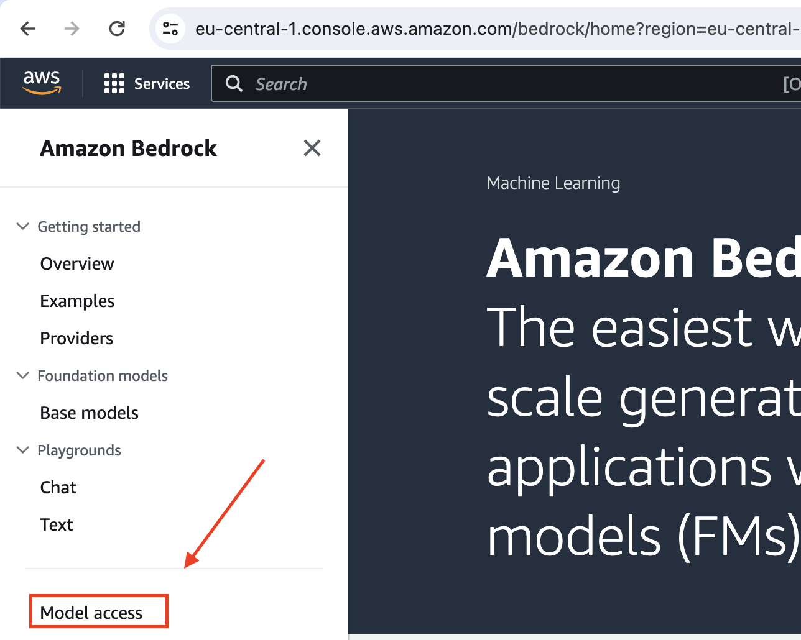
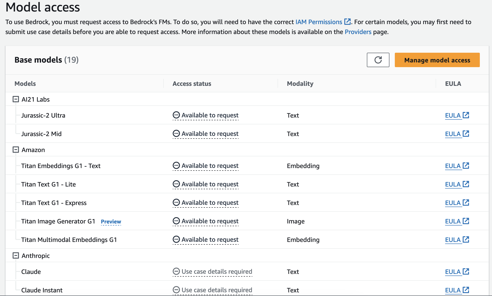
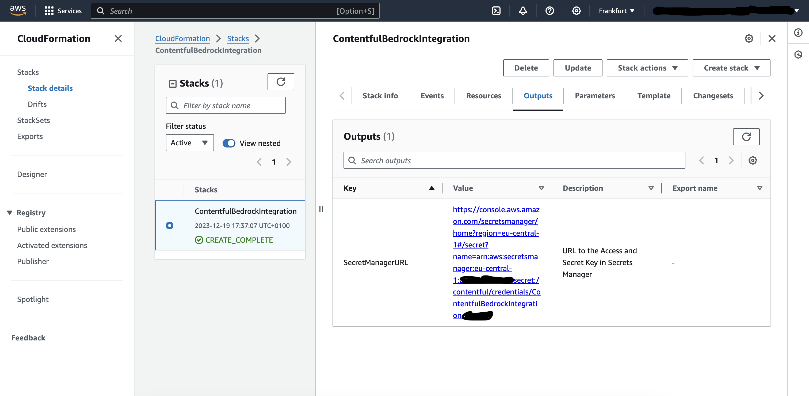

# Set up your AWS account for use with Contentful's Bedrock Content Generator

This guide will help you to setup your AWS account for Contentful to access Amazon Bedrock. To gain access to various Bedrock Models the only prerequisite is to have an AWS account.

Amazon Bedrock is a fully managed service and it is serverless in nature that provides a selection of high-performing foundation models (FMs) from leading AI companies, including AI21 Labs, Anthropic, Cohere, Meta, Stability AI, and Amazon itself. The service offers a unified API and a range of features to simplify the development of generative AI applications, making it accessible to a wider range of users without compromising on privacy and security.

## Prerequisites

You will need an AWS account and have to be logged in. Refer to the AWS Account Creation Documentation for a detailed [guide](https://docs.aws.amazon.com/accounts/latest/reference/manage-acct-creating.html).

> Note: A credit card is required for account creation, but you won't be billed for this step.
> :warning:
> Because of the critical nature of the root user of the account, we strongly recommend that you use an email address that can be accessed by a group, rather than only an individual. That way, if the person who signed up for the AWS account leaves the company, the AWS account can still be used because the email address is still accessible. If you lose access to the email address associated with the AWS account, then you can't recover access to the account if you ever lose the password.

## Cost

Deployment cost of this template will vary by region (e.g. 0,40 USD), it will use [one managed secret](https://aws.amazon.com/de/secrets-manager/pricing/) (the Access and Secret Keys that are generated) - feel free to delete the secret after you stored them securely.
Usage of Bedrock will incur cost. Please see the [Amazon Bedrock pricing](https://aws.amazon.com/de/bedrock/pricing/) page for details. See [Setup cost alerts and budgets](#setup-cost-alerts-and-budgets) for a way to control your costs by applying limits to your Bedrock usage.

## Setup instructions

## 1. **Enable Access to Bedrock Large Language Models:**

_Note_ Bedrock is not supported in all regions, and the availablity for models may vary by region. Please select the region that matches your needs. The access key won't be limited to a region - you may use the same key for multiple regions. You will have to request model access for each region.

- Log into the AWS Console and select your preferred region.
- Navigate to Bedrock and select 'Model access' from the left hand menu. 
- Enable the models you wish to use.
- 
- By clicking on **Manage model access** you can request the models you’d like access to, and then click **Save changes**.

_Note You won’t be charged for just having access to the model; charges only accrue when you use the model. Also, not all models will be available, and some (like Claude) will require you to submit a use case before access is granted._

For detailed instructions, see [Model Access Documentation](https://docs.aws.amazon.com/bedrock/latest/userguide/model-access.html).

## 2. Set Up Permissions and get the API Key

_Note: This template should work in all regions, not limited ot the region Bedrock is available. In the selected region the Access Token is going to be stored in AWS Secrets Manager._

To prepare your AWS account to be used for Contentful simply click one of the buttons at the end of this chapter and follow the instructions (no changes are needed to the given defaults). This will deploy a CloudFormation stack in your account, creating the required IAM User with the needed permissions, and generates access keys for you.

Once the stack completes you can find a link to the credentials in the `output` tab. Simply click the link and save the credentials in your Contentful application. You can delete the secret afterwards from Secrets Manager (this secret would otherwise cost a small amount for each month of usage).

| Region                      |                  | CloudFormation Stack                                                                                                                                                                                                                                                                                                                                       |
| --------------------------- | ---------------- | ---------------------------------------------------------------------------------------------------------------------------------------------------------------------------------------------------------------------------------------------------------------------------------------------------------------------------------------------------------- |
| US East (N. Virginia)       | **us-east-1**    |        |
| Europe (Frankfurt)          | **eu-central-1** |  |
| Use currently active region | ---              |                                  |

#### Supported Regions

_Note: Models vary by region._

> - US East (N. Virginia)
> - US West (Oregon)
> - Europe (Frankfurt)

## 3. Maintainability / Updates / Next Steps

### Setup cost alerts and budgets

To provide you an easy entry to cost controling we created a CloudFormation template for you which sets up a soft and hard limit for your accounts Bedrock usage. upon reaching the limits you will be notified via your supplied email address and/or phone number. Upon reaching the hard limit, the created IAM User for accessing Bedrock will have it's policies removed for acessing Bedrock. That way no further Bedrock usage can be issued until the Budget Limits have been raised and the policy has been reattached.

| Region                      |                  | CloudFormation Stack                                                                                                                                                                                                                                                                                                                                             |
| --------------------------- | ---------------- | ---------------------------------------------------------------------------------------------------------------------------------------------------------------------------------------------------------------------------------------------------------------------------------------------------------------------------------------------------------------- |
| US East (N. Virginia)       | **us-east-1**    |        |
| Europe (Frankfurt)          | **eu-central-1** |  |
| Use currently active region | ---              |                                  |

Learn more about [cost alerts and budgets](https://docs.aws.amazon.com/cost-management/latest/userguide/budgets-managing-costs.html).

### Access to new models

Once new models become available you will have to request access to these models, to make them usable within your Contentful application. Keep an eye out for new models and enable them as required.

### Monitor Amazon Bedrock Usage

[Monitor Amazon Bedrock](https://docs.aws.amazon.com/bedrock/latest/userguide/monitoring.html)

### Cleanup

Remember to delete the SecretsManager key after retrieving it.

### Long term maintenance

The cost control part of the CloudFormation template is solved using a Lambda function to remove the policy from the Contentful Bedrock user. That Lambda function is written in Python, eventually the underlying Python version will need updating, which might or might not require code adaption. At the time of writing the Python runtime version is 3.12, which should be supported [until 2028](https://devguide.python.org/versions/).

### Deletion

In case you no longer want to use this solution you can delete the executed cloudformation templates which will rollback any generated resources, leaving you with whatever has been configured before in your AWS account.

## Further Documentation

This [Blog Post](https://community.aws/content/2ZAHJMCN4Ffi6W2DPJFIgq8MHkX/aws-bedrock---learning-series---blog-1) goes into further details on how to set up Bedrock.
