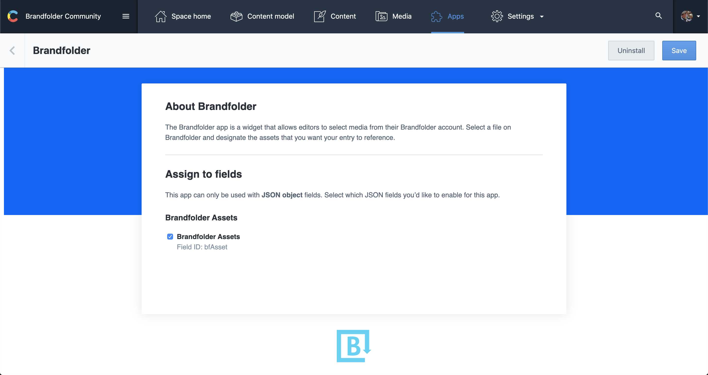
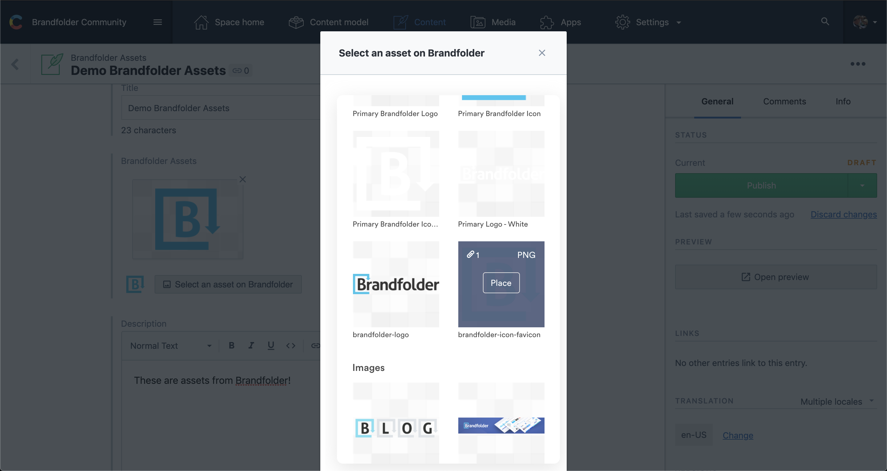
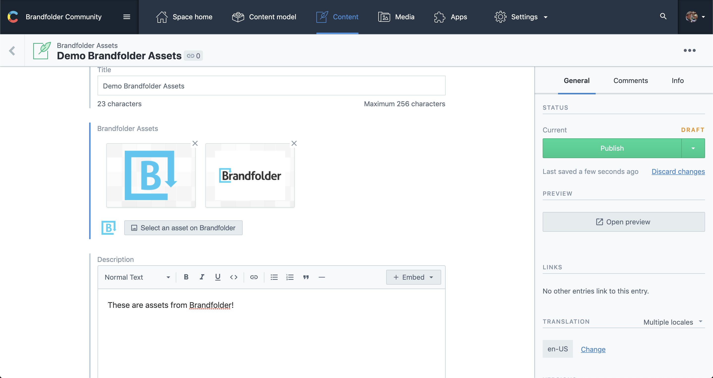

# Brandfolder

After you’ve installed the [Brandfolder app](https://app.contentful.com/deeplink?link=apps&id=brandfolder), you can easily reference assets hosted on Brandfolder directly inside the Contentful web app.

## Overview

The Brandfolder app is a widget that allows editors to select media from their Brandfolder account. Simply click `Select an asset on Brandfolder` and select the asset you want to be referenced from your entry.

The IDs and URLs of selected assets are then stored in Contentful. Inside your client application, you then fetch content from Contentful and resolve any additional details on assets by using the IDs to fetch more data from Brandfolder's API.

## Requirements
To use this app, you will need:

- Your Brandfolder API Key [https://brandfolder.com/profile#integrations](https://brandfolder.com/profile#integrations)
- A content type with a field of type JSON object to hold the references to Brandfolder assets

## Usage

### Step 1: Install and configure
Under field assignment, select the content type fields that you want this app to be used for. Please note that only compatible fields of type JSON object are displayed here.

Click `Install` to finish the installation and save the configuration.

### Step 2: How to use the app

To reference an asset on Brandfolder from your entry:

- Click `Select an asset on Brandfolder`
- Submit your Brandfolder API key in the dialog
- Find an asset in Brandfolder using the dialog
- Click `Place`
- Repeat for as many assets as you wish to include in your entry

Previews of your assets will now appear in your entry.
These can be reordered by dragging and dropping, or removed by clicking the `X` in the upper right corner.

## FAQ
### What to do if the entry editor displays the warning `Field value is incompatible`?
The `JSON object` field of this entry already contains data that was not generated by the Brandfolder app. Please ensure that you've selected the correct field in the app configuration to be used with Brandfolder, and that you no longer need the previously entered data. Then select `I want to override the value using the App.`, which will initialize the field with an empty selection. Now you can start to add assets to your entry.

To access the underlying field value, deselect the field in the Brandfolder app configuration. This will reset the editor to the default JSON display for object fields.
