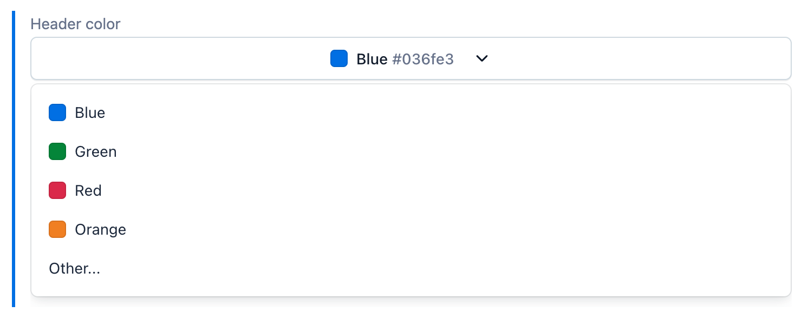

This project was bootstrapped with [Create Contentful App](https://github.com/contentful/create-contentful-app).

[](https://app.contentful.com/deeplink?link=apps&id=4Vy3oAINwRgnxakoTz06tG)

## Overview

The Color Picker app allows you to select colors within Contentful fields.



## JSON response

When assigned to a JSON field, the app stored the value in the following format:

```json
{
  "id": "047d8164-b131-4b9d-80b5-ba06e9ef4cbf",
  "name": "Blue",
  "value": "#0088cc"
}
```