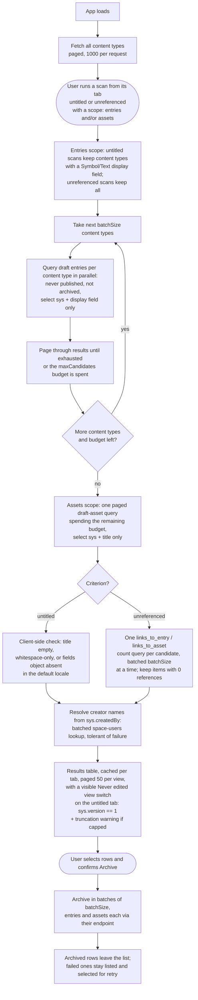

# Find Orphans

A Contentful App Framework **page app** that finds orphaned draft entries and media assets,
under either of two definitions of "orphan":

- **Untitled drafts** — items likely created by mistake, the classic case being clicking
  "Create new entry" (or "Add new media") on a reference field when you meant to link an
  existing item, leaving behind an empty, untitled draft. These are confident junk.
- **Unreferenced drafts** — items that no entry links to. This is a *lead*, not a verdict:
  top-level content such as landing pages is often never referenced yet perfectly valid, so
  these results are for review, possibly-unused content.

## How it works

Each criterion lives in **its own tab** with its own scan button and its own cached results —
separate scans because the two result sets carry different expectations (archive-freely junk
versus review-first leads), and per-tab caching because comparing them should be free: run the
untitled scan, switch to the unreferenced tab and scan there, switch back, and the first
results are still sitting in their table, with the counts shown right on the tab labels. Every
scan covers **drafts** (never published, not archived). The page subtitle stays general; each
tab explains its own criterion with a description inside the panel, always visible above the
scan button — the unreferenced one leads with the warning that reference checking is one
network request per draft and can take several minutes on large spaces. (Tab labels carry only
the name and cached result count; switching tabs is free, so the description is never more than
a click away.) Two checkboxes control the scope (entries
and/or assets, both on by default, shared across tabs) — they decide what the next scan fetches
AND live-filter already-scanned results client-side, hiding (and deselecting) that kind's rows
without a re-scan. The per-content-type entry queries are the slow part of candidate
collection, so an assets-only pass is quick.

**Untitled criterion**: flags drafts whose **title has no value** in the default locale —
including whitespace-only values, which the editors also render as "Untitled". For entries the
title is the content type's display field, and content types whose display field is not a
`Symbol`/`Text` field are skipped, since their entries cannot be missing a title. Assets have a
fixed shape, so their localized `title` field is checked directly and the whole media library
is a single paged query.

**Unreferenced criterion**: flags drafts that **no entry links to**, using one
`links_to_entry` (or `links_to_asset`) count query per candidate — the CMA can only check
referenced-ness for one target id per request, so this scan costs one extra API call per draft
and is much slower on large spaces (its button's info tooltip says so). Every content type
participates (any entry can be a link target), results keep their real titles, and the
never-edited filter below does not apply — an unreferenced entry is worth flagging no matter
how often it was edited.

Scans are **broad first, strict on demand**: edit history never excludes anything at scan time.
Instead, every result carries a never-edited flag and the untitled tab's results header has a
segmented view switch — **Show: "All (N)" / "Never edited (M)"** — where exactly one pill is
always pressed, so the current view and both counts are always visible. (The unreferenced tab
has no such switch: edit history says nothing about whether something is referenced.) The strict view narrows the table to
items never saved after creation (`sys.version === 1`); its pill carries a tooltip explaining
the term — including that archiving and unarchiving counts as editing, so restored orphans
appear only under "All", where they may still be worth archiving again. The CMA bumps `sys.version` on every save — and on publish, unpublish,
archive, unarchive and (for assets) file processing, but those states are already excluded by
the draft scope — so version 1 can only mean the item was created and then abandoned untouched.
Narrowing the view also narrows the selection, so the archive action can never touch a hidden
row, and when the filter hides every result a note says so instead of showing an empty table.
The untitled tab starts on the "Never edited" view — the confident-junk subset — with "All" one
click away; filtering is instant and client-side, never a re-scan.

**Why the two lists can differ**: an "Untitled" row in the unreferenced results that the
untitled tab does not show is not a bug — it is one of two documented cases. Either the draft
was edited after creation and the "Never edited" filter is hiding it (the toggle shows the
count; note that **archiving and then unarchiving an item also bumps `sys.version`**, so
orphans that were archived and restored no longer count as never-edited), or the entry belongs
to a content type with **no display field configured** (common for component types like
banners) — such entries always render as "Untitled" in Contentful, and the untitled scan skips
those types deliberately, because flagging every draft of them would sweep in legitimate
work-in-progress. Both cases are pinned in tests.

Neither criterion is something the regular Contentful search can express: title filters only
work for one content type at a time (every content type defines its own display field), and
referenced-ness is not a searchable attribute at all. The app automates both checks across the
whole content model.

Results are listed in one table with their title (untitled-scan results show the editor's
"Untitled" placeholder; unreferenced ones show their real titles), type (the content type name,
or "Asset"), creation date, and creator, and the result count spells out the split (e.g. "19
entries and 4 assets found"). The date shown is **created**, not last-updated — orphans were (by default) never
edited after creation, so the creation moment is what identifies the mistake. The creator comes
from `sys.createdBy`, resolved to names via one batched space-users lookup per scan; items
created by apps or automations show "App", and creators who cannot be resolved (left the space,
or the caller may not list users) show "Unknown user". Each row has an explicit "Preview"
action that opens the matching editor in a slide-in for review.

Large result sets are paginated, 50 rows per page, so the results header (counts, view switch,
archive button) stays within reach. Pagination is purely client-side navigation — all results
are already in memory, so paging costs no API calls, and unlike the scope checkboxes and the
never-edited switch it does NOT narrow the selection: select-all selects every result across
all pages, so "archive all 300" stays one click (the count line and the itemized confirmation
spell out the full sweep). The page resets to the first whenever the displayed set is reshaped
(new scan, scope or view change) and clamps when rows vanish beneath it (archiving away the
last page).

Each tab's results can also be downloaded as a CSV file ("Export CSV" next to the archive
button) for offline review. The export is broad like the scan: it always contains **every**
result the scan found — including rows currently hidden by the scope checkboxes or the
never-edited view, which is why the button's tooltip says so — with the flags in their own
columns so filtering happens visibly in the spreadsheet. Columns: Kind, ID, Title (blank for
untitled results, so a blank-title spreadsheet filter matches them), Type, Created, Created
by, Edited after creation (positive phrasing — a "Never edited" column would make
double-negative cells; the UI's "Never edited" view is this column filtered to "no"), and an
Editor URL deep link that opens the entry or asset editor directly.
Titles and creator names are quoted per RFC 4180 and leading `=`/`+`/`-`/`@` characters are
neutralized so content cannot smuggle spreadsheet formulas into the file.

Rows can be selected individually or all at once; to act on one kind only, uncheck the other
kind's scope checkbox — that hides and deselects its rows — and then select all, so archiving
all entries never sweeps assets along. The selected items are archived in bulk after a
confirmation dialog that itemizes the selection by kind ("Archive 19 entries and 4 assets"); archiving runs in rate-limit-friendly batches
through the endpoint matching each item's kind, and items that fail to archive stay listed and
selected for retry. Archiving is reversible from the editor; the archive button's tooltip (on
its info end-icon) says so, and the confirmation dialog deep-links (in a new tab) to the web
app's archived-entries and archived-assets views —
`…/views/entries?filters.0.key=__status&filters.0.op=&filters.0.val=archived` — where permanent
deletion lives.

Scans are capped at a configurable number of draft items per run (500 by default, entries and
assets sharing the one budget, see Configuration below) to stay friendly to CMA rate limits; a
warning is shown when the cap is hit.

## Logic flow



A scope that is unchecked for the run skips its block entirely: entries-only scans never query
the media library, and assets-only scans jump straight to the asset query.

The empty-title check runs client-side rather than via the API's `[exists]` operator for two
reasons: `[exists]` misses whitespace-only titles, and items with no value in any selected
field come back from the CMA with no `fields` object at all — both shapes must count as
orphans. The version check is also client-side by necessity: `sys.version` is not a queryable
attribute in CMA searches, but it is part of every returned `sys` object, so the check costs no
extra API traffic.

## Configuration

The app configuration screen (space settings, Apps) exposes installation parameters. The
parameter definitions on the app definition must use exactly these values (the IDs must match
`AppInstallationParameters` in `src/parameters.ts`):

| Display name | ID | Type | Required | Default value | Description |
|--------------|----|------|----------|---------------|-------------|
| Maximum entries per scan | `maxCandidates` | Number | Yes | `500` | The scan stops after this many draft entries and assets, to stay friendly to API rate limits. |
| Concurrent API requests | `batchSize` | Number | Yes | `5` | How many CMA requests run at once while scanning and archiving. Must be between 1 and 7, the CMA rate limit per second. |

(A third parameter, `untouchedOnly`, existed briefly and was retired: it only chose the
untitled tab's starting view, which the visible "All / Never edited" switch makes a per-user,
one-click choice. `resolveParameters()` ignores it if an installation still stores it.)

Rather than maintaining these by hand in the web UI, sync them with the bundled script — the
definitions above live in `scripts/update-app-parameters.mjs` as the single source of truth,
and the script replaces the app definition's installation parameters wholesale via the CMA:

```bash
CONTENTFUL_ACCESS_TOKEN=<cma token with org access> \
CONTENTFUL_ORG_ID=<organization id> \
CONTENTFUL_APP_DEF_ID=<app definition id> \
npm run update-app-parameters
```

Run it whenever a parameter is added or its wording changes (the org and app definition ids are
under Organization settings → Apps in the web app).

All parameters are required and their defaults are set on the parameter definition, so a fresh
install starts with the values above. The config screen shows the same defaults as input
placeholders, and its save validation rejects empty, non-positive, or out-of-range values. As a
safety net, `resolveParameters()` still falls back to the defaults at scan time if the stored
parameters are ever missing or invalid.

## Development

```bash
npm install
npm start        # dev server on http://localhost:3000
npm test         # vitest watch mode
npm run test:ci  # single test run
npm run lint     # ESLint over the whole app, warnings fail (--max-warnings 0)
npm run lint:fix # same, applying auto-fixes
npm run build    # production bundle in ./build
```

To install into a space, create an app definition with a **Page** location:

```bash
npm run create-app-definition
```

### Seeding test data

To exercise the scan against a space with many drafts, the seed script fills a
test environment with known quantities of untitled drafts, titled unreferenced
drafts, referenced drafts (linked from published container entries), fileless
draft assets, and optional published filler. Copy `.env.seed.example` to
`.env.seed`, point it at a **dedicated test space**, then:

```bash
npm run seed-test-data           # create the data (prints expected scan results)
npm run seed-test-data:cleanup   # delete everything the script created
```

The expected-results summary at the end is computed from what was actually
created: if some requests fail (the script retries but a CMA outage can still
lose items), it prints a warning and adjusted per-criterion counts instead of
the configured ones — in particular, "referenced" items whose container entry
failed to create are counted as unreferenced, since nothing links to them.
The summary describes a single run into a clean environment; the script is
additive, so run cleanup between runs to keep the counts exact.

Everything is tagged `seedTestData` and typed `seedOrphanTest`, so cleanup is
exact. Note that published volume adds no API calls to a scan — the draft
filters are server-side — but it does grow the corpus the `links_to_entry`
reference searches run over and counts toward the plan's record limit, which
is what the `SEED_PUBLISHED_ENTRIES` knob is for.

## Learn more

- [Contentful App Framework](https://www.contentful.com/developers/docs/extensibility/app-framework/)
- [Links and incoming-link queries](https://www.contentful.com/developers/docs/references/content-delivery-api/links/#links-to-a-specific-item) — background on `links_to_entry`; the field-filter variant documented there needs the linking content type and field to be known, which is why the unreferenced scan uses one `links_to_entry`/`links_to_asset` count query per item instead
- [Page location](https://www.contentful.com/developers/docs/extensibility/app-framework/locations/#page)
- [Forma 36](https://f36.contentful.com/)
