# Find Orphans

A Contentful App Framework **page app** that finds draft entries and media assets that were
likely created by mistake — the classic case being clicking "Create new entry" (or "Add new
media") on a reference field when you meant to link an existing item, leaving behind an empty,
untitled draft.

## How it works

The app scans the current environment for **draft entries and assets** (never published, not
archived) whose **title has no value** in the default locale — including whitespace-only values,
which the editors also render as "Untitled". For entries the title is the content type's display
field; assets have a fixed shape, so their localized `title` field is checked directly and the
whole media library is a single paged query. Two checkboxes next to the scan button control the
scope per run (entries and/or assets, both on by default) — the per-content-type entry queries
are the slow part of a scan, so an assets-only pass is quick.

By default the scan additionally requires that the item was **never edited after creation**
(`sys.version === 1`). The CMA bumps `sys.version` on every save — and on publish, unpublish,
archive, unarchive and (for assets) file processing, but those states are already excluded by
the draft scope — so on a candidate, version 1 can only mean the item was created and then
abandoned untouched. This keeps untitled work-in-progress drafts (body started, title not yet
filled in) out of the results; uploaded assets get their title auto-filled from the filename, so
untitled assets are almost always accidental creations. The filter can be turned off via the
`untouchedOnly` installation parameter, which is useful when apps or scripts write to items on
creation and bump every one past version 1.

This is something the regular Contentful search cannot do in one query: field filters only work
for one content type at a time, and every content type defines its own display field. The app
automates that per-content-type check across the whole content model. Content types whose
display field is not a `Symbol`/`Text` field are skipped, since their entries cannot be missing
a title.

Results are listed in one table with their type (the content type name, or "Asset"), creation
date, and creator, and the result count spells out the split (e.g. "19 entries and 4 assets
found"). The date shown is **created**, not last-updated — orphans were (by default) never
edited after creation, so the creation moment is what identifies the mistake. The creator comes
from `sys.createdBy`, resolved to names via one batched space-users lookup per scan; items
created by apps or automations show "App", and creators who cannot be resolved (left the space,
or the caller may not list users) show "Unknown user". Each row has an explicit "Preview"
action that opens the matching editor in a slide-in for review.

Rows can be selected individually, all at once, or per kind — when the results mix entries and
assets, "Entries (N)" / "Assets (N)" toggle buttons select or deselect everything of one kind
(the pressed state mirrors the selection), so archiving all entries never sweeps assets along.
The selected items are archived in bulk after a confirmation dialog that itemizes the selection
by kind ("Archive 19 entries and 4 assets"); archiving runs in rate-limit-friendly batches
through the endpoint matching each item's kind, and items that fail to archive stay listed and
selected for retry. Archiving is reversible from the editor; an info popover next to the
archive button spells this out and deep-links (in a new tab) to the web app's archived-entries
and archived-assets views — `…/views/entries?filters.0.key=__status&filters.0.op=&filters.0.val=archived`
— where permanent deletion lives.

Scans are capped at a configurable number of draft items per run (500 by default, entries and
assets sharing the one budget, see Configuration below) to stay friendly to CMA rate limits; a
warning is shown when the cap is hit.

## Logic flow

```mermaid
flowchart TD
    Load[App loads] --> FetchCT[Fetch all content types<br/>paged, 1000 per request]
    FetchCT --> Scan([User clicks Scan with a scope:<br/>entries and/or media assets])
    Scan --> Filter[Entries scope: keep content types whose<br/>display field is a Symbol or Text field]
    Filter --> Chunk[Take next batchSize content types]
    Chunk --> Query[Query draft entries per content type in parallel:<br/>never published, not archived,<br/>select sys + display field only]
    Query --> Pages[Page through results until exhausted<br/>or the maxCandidates budget is spent]
    Pages --> More{More content types<br/>and budget left?}
    More -- yes --> Chunk
    More -- no --> AssetStep[Assets scope: one paged draft-asset query<br/>spending the remaining budget,<br/>select sys + title only]
    AssetStep --> Check[Client-side check: title empty,<br/>whitespace-only, or fields object absent<br/>in the default locale]
    Check --> Untouched{untouchedOnly<br/>enabled?}
    Untouched -- yes --> Version[Keep only items never edited<br/>after creation: sys.version == 1]
    Untouched -- no --> Resolve
    Version --> Resolve[Resolve creator names from sys.createdBy:<br/>batched space-users lookup, tolerant of failure]
    Resolve --> Results[Results table<br/>+ truncation warning if capped]
    Results --> Archive([User selects rows and confirms Archive])
    Archive --> Batches[Archive in batches of batchSize,<br/>entries and assets each via their endpoint]
    Batches --> Done[Archived rows leave the list;<br/>failed ones stay listed and selected for retry]
```



A scope that is unchecked for the run skips its block entirely: entries-only scans never query
the media library, and assets-only scans jump straight to the asset query.

The empty-title check runs client-side rather than via the API's `[exists]` operator for two
reasons: `[exists]` misses whitespace-only titles, and items with no value in any selected
field come back from the CMA with no `fields` object at all — both shapes must count as
orphans. The version check is also client-side by necessity: `sys.version` is not a queryable
attribute in CMA searches, but it is part of every returned `sys` object, so the check costs no
extra API traffic.

## Configuration

The app configuration screen (space settings, Apps) exposes installation parameters. When
registering the app definition, create the parameter definitions with exactly these values
(the IDs must match `AppInstallationParameters` in `src/parameters.ts`):

| Display name | ID | Type | Required | Default value | Description |
|--------------|----|------|----------|---------------|-------------|
| Maximum entries per scan | `maxCandidates` | Number | Yes | `500` | The scan stops after this many draft entries and assets, to stay friendly to API rate limits. |
| Concurrent API requests | `batchSize` | Number | Yes | `5` | How many CMA requests run at once while scanning and archiving. Must be between 1 and 7, the CMA rate limit per second. |
| Only include entries that were never edited | `untouchedOnly` | Boolean | Yes | `true` | Only flag drafts still at version 1, i.e. never saved after creation. Turn off to also catch untitled drafts that were edited and then abandoned. |

All parameters are required and their defaults are set on the parameter definition, so a fresh
install starts with the values above. The config screen shows the same defaults as input
placeholders, and its save validation rejects empty, non-positive, or out-of-range values. As a
safety net, `resolveParameters()` still falls back to the defaults at scan time if the stored
parameters are ever missing or invalid.

## Development

```bash
npm install
npm start        # dev server on http://localhost:3000
npm test         # vitest watch mode
npm run test:ci  # single test run
npm run build    # production bundle in ./build
```

To install into a space, create an app definition with a **Page** location:

```bash
npm run create-app-definition
```

## Learn more

- [Contentful App Framework](https://www.contentful.com/developers/docs/extensibility/app-framework/)
- [Page location](https://www.contentful.com/developers/docs/extensibility/app-framework/locations/#page)
- [Forma 36](https://f36.contentful.com/)
