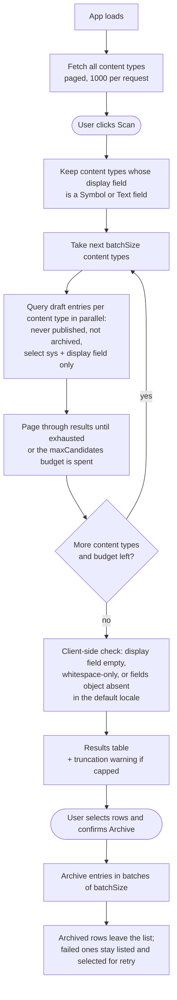

# Find Orphans

A Contentful App Framework **page app** that finds draft entries that were likely created by
mistake — the classic case being clicking "Create new entry" on a reference field when you meant
to link an existing entry, leaving behind an empty, untitled draft.

## How it works

The app scans the current environment for **draft entries** (never published, not archived)
whose **display (title) field has no value** in the default locale — including whitespace-only
values, which the entry editor also renders as "Untitled".

This is something the regular Contentful search cannot do in one query: field filters only work
for one content type at a time, and every content type defines its own display field. The app
automates that per-content-type check across the whole content model. Content types whose
display field is not a `Symbol`/`Text` field are skipped, since their entries cannot be missing
a title.

Results are listed with their content type and last-updated date. Each row has an explicit
"Preview" action that opens the entry editor in a slide-in for review. Rows can be selected
individually or all at once, and the selected entries archived in bulk after a confirmation
dialog; archiving runs in rate-limit-friendly batches, and entries that fail to archive stay
listed and selected for retry. Archiving is reversible from the entry editor.

Scans are capped at a configurable number of draft entries per run (500 by default, see
Configuration below) to stay friendly to CMA rate limits; a warning is shown when the cap is
hit.

## Logic flow



The empty-title check runs client-side rather than via the API's `[exists]` operator for two
reasons: `[exists]` misses whitespace-only titles, and entries with no value in any selected
field come back from the CMA with no `fields` object at all — both shapes must count as
orphans.

## Configuration

The app configuration screen (space settings, Apps) exposes installation parameters. When
registering the app definition, create the parameter definitions with exactly these values
(the IDs must match `AppInstallationParameters` in `src/parameters.ts`):

| Display name | ID | Type | Required | Default value | Description |
|--------------|----|------|----------|---------------|-------------|
| Maximum entries per scan | `maxCandidates` | Number | Yes | `500` | The scan stops after this many draft entries, to stay friendly to API rate limits. |
| Concurrent API requests | `batchSize` | Number | Yes | `5` | How many CMA requests run at once while scanning and archiving. Must be between 1 and 7, the CMA rate limit per second. |

Both parameters are required and their defaults are set on the parameter definition, so a fresh
install starts with the values above. The config screen shows the same defaults as input
placeholders, and its save validation rejects empty, non-positive, or out-of-range values. As a
safety net, `resolveParameters()` still falls back to the defaults at scan time if the stored
parameters are ever missing or invalid.

## Development

```bash
npm install
npm start        # dev server on http://localhost:3000
npm test         # vitest watch mode
npm run test:ci  # single test run
npm run build    # production bundle in ./build
```

To install into a space, create an app definition with a **Page** location:

```bash
npm run create-app-definition
```

## Learn more

- [Contentful App Framework](https://www.contentful.com/developers/docs/extensibility/app-framework/)
- [Page location](https://www.contentful.com/developers/docs/extensibility/app-framework/locations/#page)
- [Forma 36](https://f36.contentful.com/)
