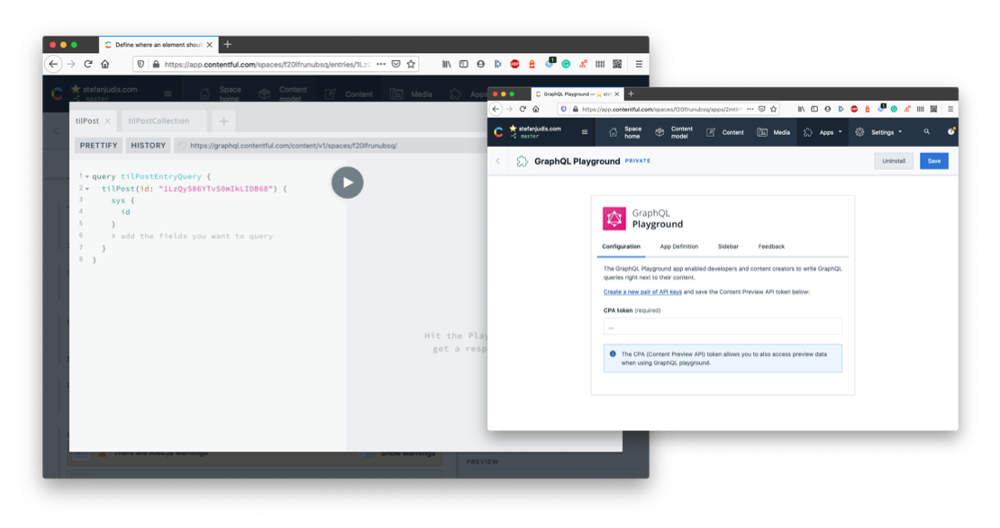
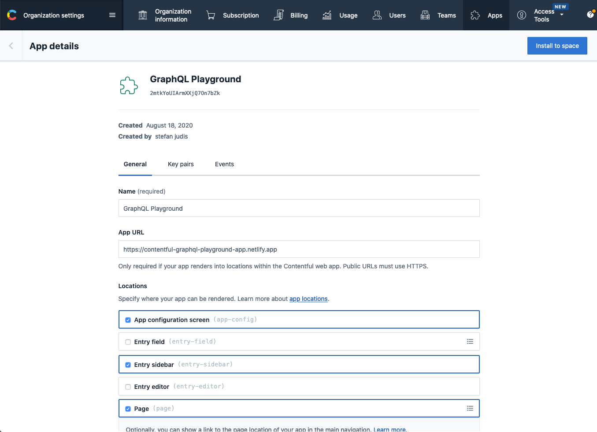

# Contentful GraphQL Playground App

> A [Contentful App](https://www.contentful.com/developers/docs/extensibility/app-framework/) to query Contentful's GraphQL API using GraphQL Playground right from with in web interface.

## Setup

### Installation from the Contentful Marketplace

Open [the Contentful GraphQL Playground app Marketplace entry](https://www.contentful.com/marketplace/app/graphql-playground/) and hit "Install now".

### Manual setup (only needed for development)

[The Contentful App Framework](https://www.contentful.com/developers/docs/extensibility/app-framework/) allows developers to extend the Contentful UI with custom functionality. You can install the app and use its hosted version without editing any code.

To install and develop this app head over to your organization settings and create a new app.

Define the application name you prefer and the following App URL: `https://contentful-graphql-playground-app.netlify.app`.

This app supports the following locations in the Contentful UI:

- (Required) App configuration screen (`app-config`) – configure the GraphQL playground app
- (Optional) Entry sidebar (`entry-sidebar`) - open GraphQL playground from the entry editor sidebar
- (Optional) Page (`page`) - use GraphQL playground as a full page app

_Make sure to enable the App configuration screen to configure the application._

Install the app into your preferred space. Create and define a CPA (Content Preview API) token and save the configuration. Follow the instructions inside of the app configuration screen to enable the app for the entry sidebar.

Happy querying! 👋

## Development

> This project was bootstrapped with [Create Contentful App](https://github.com/contentful/create-contentful-app).

In the project directory, you can run:

#### `npm start`

Creates or update your app definition in contentful, and runs the app in development mode.
Open your app to view it in the browser.

The page will reload if you make edits.
You will also see any lint errors in the console.

#### `npm run build`

Builds the app for production to the `build` folder.
It correctly bundles React in production mode and optimizes the build for the best performance.

The build is minified and the filenames include the hashes.
Your app is ready to be deployed!

## Learn More

[Read more](https://www.contentful.com/developers/docs/extensibility/app-framework/create-contentful-app/) and check out the video on how to use the CLI.

Create Contentful App uses [Create React App](https://create-react-app.dev/). You can learn more in the [Create React App documentation](https://facebook.github.io/create-react-app/docs/getting-started) and how to further customize your app.
