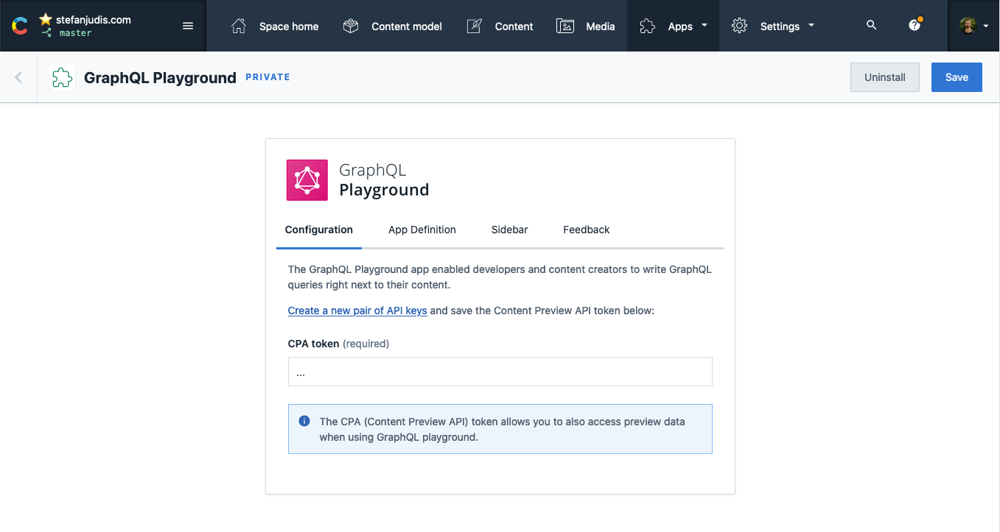

# Contentful GraphQL Playground App

> A [Contentful App](https://www.contentful.com/developers/docs/extensibility/app-framework/) to query Contentful's GraphQL API using GraphQL Playground right from with in web interface.


## Setup

### Installation from the Contentful Marketplace

Open [the Contentful GraphQL Playground app Marketplace entry](https://www.contentful.com/marketplace/app/graphql-playground/) and hit "Install now".

### Manual setup (only needed for local development)

[The Contentful App Framework](https://www.contentful.com/developers/docs/extensibility/app-framework/) allows developers to extend the Contentful UI with custom functionality.

#### Starting the app locally

In order to start developing on the _Contentful GraphQL Playground App_ you need to start it on your machine

```sh
npm start
```
#### Configure and install the app

To install and develop this app head over to your organization settings and create a new app.


Define the application name you prefer and the following App URL: `http://localhost:3000`.

This app supports the following locations in the Contentful UI:

- (Required) App configuration screen (`app-config`) – configure the GraphQL playground app
- (Optional) Entry sidebar (`entry-sidebar`) - open GraphQL playground from the entry editor sidebar
- (Optional) Page (`page`) - use GraphQL playground as a full page app

_Make sure to enable the App configuration screen to configure the application._



Install the app into your preferred space. Create and define a CPA (Content Preview API) token and save the configuration. Follow the instructions inside the app configuration screen to enable the app for the entry sidebar.

Happy querying! 👋

## Development

> This project was bootstrapped with [Create Contentful App](https://github.com/contentful/create-contentful-app).

In the project directory, you can run:

#### `npm start`

[Create or update your app definition](#configure-and-install-the-app) in Contentful, and run the app in development mode.
Open your app to view it in the browser.

The page will reload if you make edits.
You will also see any lint errors in the console.

#### `npm run build`

Builds the app for production to the `build` folder.
It correctly bundles React in production mode and optimizes the build for the best performance.

The build is minified and the filenames include the hashes.
Your app is ready to be deployed!

## Incorporating downstream changes

This code was originally sourced from [this repository](https://github.com/contentful/contentful-graphql-playground-app).

While we expect and encourage all the changes to be made [here](https://github.com/contentful/apps), there is a chance 
we might need to sync changes coming from the downstream repo.

At this point the process is manual, and it goes like this

```shell
# from repository's root

git subtree pull --prefix apps/graphql-playground https://github.com/contentful/contentful-graphql-playground-app main --squash
```

## Learn More

[Read more](https://www.contentful.com/developers/docs/extensibility/app-framework/create-contentful-app/) and check out the video on how to use the CLI.

Create Contentful App uses [Create React App](https://create-react-app.dev/). You can learn more in the [Create React App documentation](https://facebook.github.io/create-react-app/docs/getting-started) and how to further customize your app.
