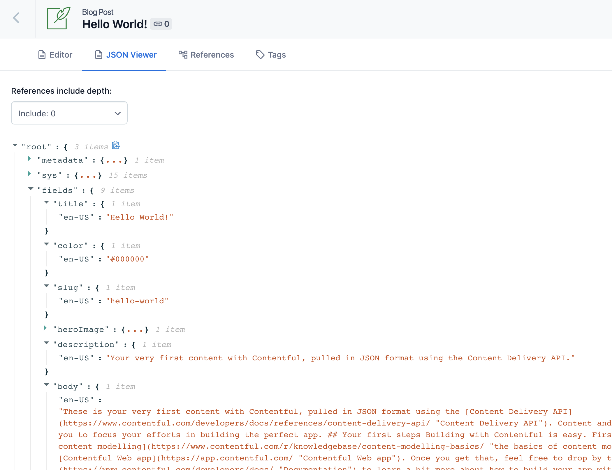
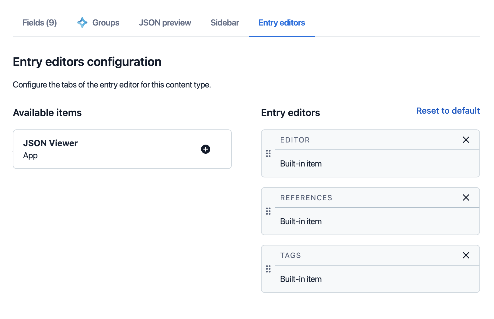
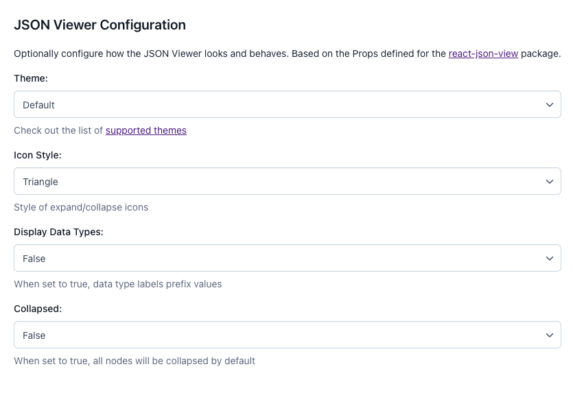

# JSON Viewer
This app adds an entry editor tab which displays the Content Management API response for the current entry. Users may select a desired references depth to pass as the `include` parameter in the request.

JSON display is handled by the [react-json-view](https://www.npmjs.com/package/react-json-view) package.

## Installation
Run the app locally:

1. Clone this repo
2. Create your [app definition](https://app.contentful.com/deeplink?link=app-definition-list)
3. This app lists a Node version in `.nvmrc`. Run `nvm use` to align your local version.
4. Run the app locally at [http://localhost:3000](http://localhost:3000) with `npm install` and `npm start`

## Setup
In Contentful, navigate to the content type to which you would like to add JSON Viewer and select the Entry Editors tab. Select the plus (+) icon on the JSON Viewer item to add it to your entry editors, and then drag/drop to place it in the desired order.

### Optional Configuration
The configuration screen allows you to choose different options for how the JSON Viewer displays. These utilize a select number of Props provided by the [react-json-view](https://www.npmjs.com/package/react-json-view) package.

## Disclaimer
Contentful provides sample code as a means to demonstrate a technical scenario; any and all sample code provided by Contentful is not intended for production use. Contentful is not responsible for maintaining sample code after it has been provided to a customer.