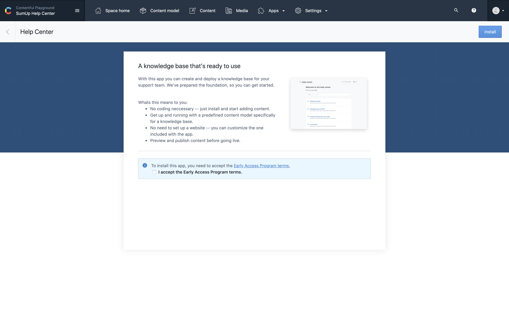
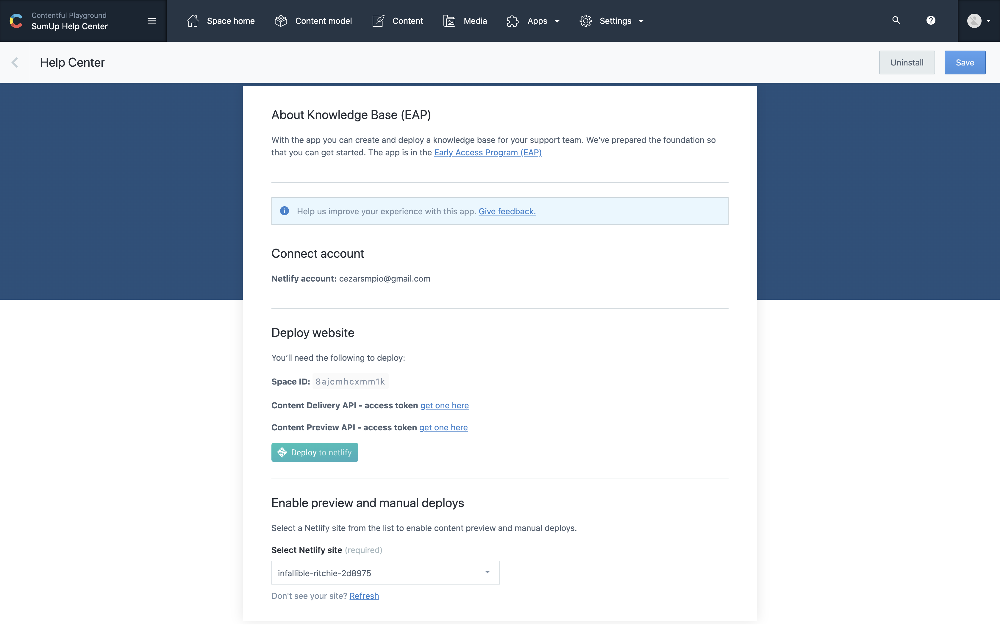

# Contentful Knowledge base app

> A Contentful Marketplace app to create new knowledge base websites within a few minutes.

## Features

- Content type creation
- Sample content creation
- Content preview
- Netlify build triggers
- Website template deploy

## Easiest way to get started

1. Create an account on [contentful.com](https://www.contentful.com/get-started/)
1. Install the [Knowledge base app](https://www.contentful.com/marketplace/) from Contentful Marketplace
1. Done!

## Making changes locally

1. [Create a new OAuth application](https://app.netlify.com/user/applications#oauth-applications) on your Netlify account
1. The `.env.example` file contains the environment variables the project needs
1. Create the `.env.development` and `.env.production` files, one for each environment respectively, and fill up the environment variables
1. Note: The env variable `NETLIFY_OAUTH_APP_REDIRECT_URI` must end with `/auth`
1. [Add the `Knowledge base` app to a Contentful organization](#adding-the-app-to-your-organization)
1. Install the dependencies by running `npm ci`
1. `npm start`

### Adding the app to your organization

You need to add the app into a organization to be able to run it locally. This command below can help you out:

```curl
curl -X POST \
  -H'Content-Type: application/json' \
  -H'Authorization: Bearer <MANAGEMENT_TOKEN_API>' \
  -d'{"name": "Knowledge base", "src": "http://localhost:1234/index.html", "locations": [{"location": "app-config"}, {"location": "entry-sidebar"}]}' \
  https://api.contentful.com/organizations/<ORGANIZATION_ID>/app_definitions
```

## Testing

It uses `jest` along with `react-testing-library`

```
npm test
```

## Stack

- TypeScript
- React
- [Contentful App Framework](https://www.contentful.com/developers/docs/extensibility/app-framework/tutorial/)

## Troubleshooting

### Environment variables not working?

Try to delete the `.cache` folder whenever changing/updating environment variables.

```
rm -rf ./.cache
```

### How to update `space-template.json`?

We use the `space-template.json` to save all the content types, entries, assets and locales needed the app installation.

The space information we use as template is stored on the `export-config.json` file.

You need to have the `contentful-cli` in order to update the `space-template.json`.

To update it, run:

```
contentful space export --config export-config.json
```

## Support

If you have any problem with this app, please file an issue.

If you have other problems with Contentful not related to this project, you can contact [Customer Support](https://support.contentful.com).

## Screenshots




## License

[MIT](LICENSE.md)
