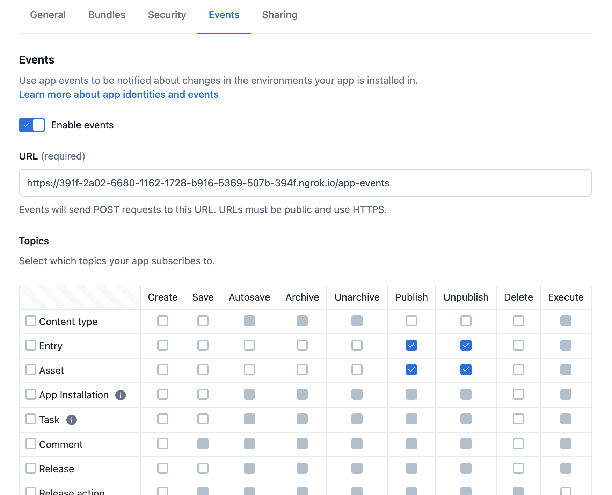

Netlify App
===

## Local Development

In order to develop Netlify App locally you will need to run locally both the Netlify Contentful 
Application (living in `frontend`), and the Lambda functions (in `lambda`) which handle Netlify build hooks.

Technologies involved are:
* [serverless](https://github.com/serverless/serverless):
to run the Lambda function on your machine
* [ngrok](https://ngrok.com/):
to create a public URL to be used as OAUTH URI

### Launching the frontend
Go to the `frontend` folder and run:
```
npm run start
```

### Launching the lambda
First, start HTTP tunnel with ngrok:
```
ngrok http 8000
```

Enable events and add https ngrok url to the events config on App definition page as follows:
`https://<ngrok url>/app-events`

Go to app's Security tab. Generate key pair and signing secret. These are needed as environment variables (see below). For example you can copy private key contents and paste it as a value to `APP_IDENTITY_PRIVATE_KEY` variable.

You would also want to enable Entry and Asset publish/unpublish events:


Run lambda with command:
```
npm run serve
```

This script expects the following environment variables to be set:

| Variable                      | Description                                                               |
| ---                           | ---                                                                       |
| `APP_IDENTITY_PRIVATE_KEY`    | Private key contents of the key pair generated via App definition page |
| `SIGNING_SECRET` | App's signing secret for request verification. Also should be generated via App definition's UI |
| `APP_DEFINITION_ID` | App definition ID |

Now you're all set and can configure your Netlify app and deploy sites!
