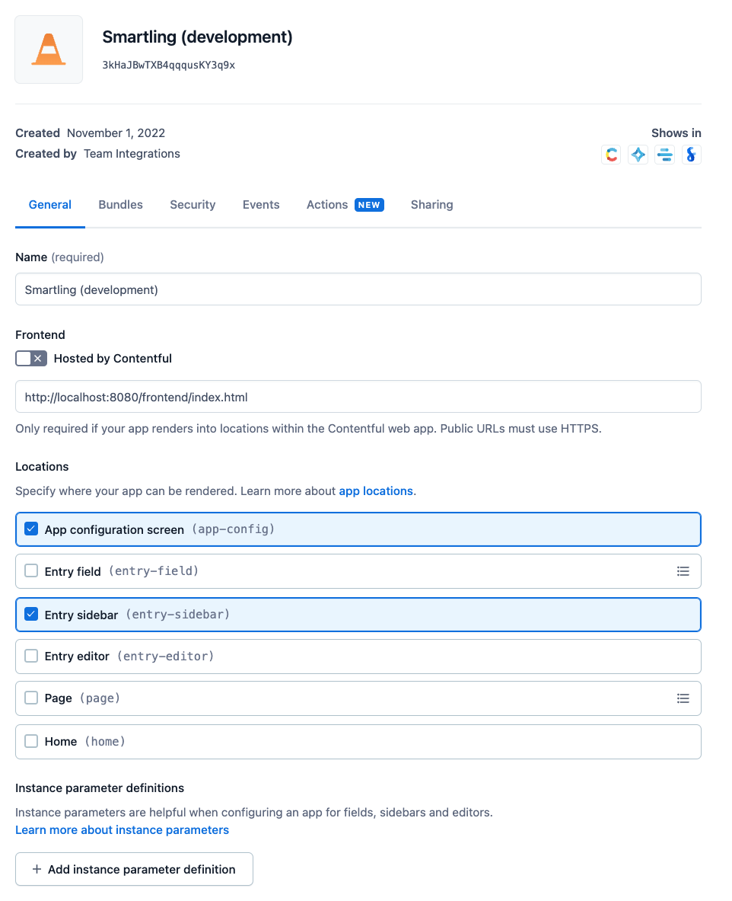

# Smartling

The Smartling app allows content editors to request a translation directly from the entry editor, and to view the status of any existing translation submissions.

[Smartling](https://www.smartling.com/) is an end to end translation management service.

## Installation and Usage

See the [Smartling App marketplace listing](https://www.contentful.com/marketplace/app/smartling/) for information about how to install and use the Smartling app in your Contentful project.

You can also learn more about [how the Smartling service integrates with Contentful](https://www.smartling.com/software/integrations/contentful/).

## Technical Overview

The Smartling app is built on top of Contentful's [app framework](https://www.smartling.com/software/integrations/contentful/)

The app provides both a frontend and a backend.

### Backend

- In production, runs as a Lambda function
- Provides authentication routes for obtaining and refreshing OAuth tokens for API requests against Smartling APIs
- Provides a route for hosting the frontend

### Frontend

- A React application that provides a Sidebar widget and App Config widget, used within Contentful's app framework.

## Local Development

Both the frontend and backend can be installed and run locally to support development.

### App Installation and Configuration

> Contentful engineers: See internal wiki for development environment credentials and details.

#### App Definition

To support local development, you'll need to create, install, and configure a new app in a Contentful organization:

1. Head over to your organization settings and create a new [app definition](https://www.contentful.com/developers/docs/extensibility/app-framework/app-definition/) which you'll use for development.
2. Provide a URL where your development app will be served from: `http://localhost:8080/frontend/index.html`
3. Choose "App configuration screen" and "Entry sidebar" as the app locations.



#### App Installation

After you've created a development app defintion above, head over to a Contentful space to install and configure the app.

- The development app definition will appear under `Apps > Your custom apps`.
- Other than using a custom app defintion, you'll just [follow the Smartling configuration instructions](https://www.contentful.com/help/smartling-app/).

> **Note**: Pay close attention to the configuration steps required on both the Smartling and Contentful sides. You will need to configure locales and content types _on both sides_ or the app will not work correctly.

### Local Setup and Development Servers

#### Frontend

To install and run the frontend:

```
npm install
npm run start
```

This will run a development server at `http://localhost:3000`

#### Backend

In production, the backend runs as a Lambda function. In development, the same code is run using the [serverless](https://github.com/serverless/serverless) framework.

The backend service expects the following environment variables to be defined:

| Variable        | Description                                                |
| --------------- | ---------------------------------------------------------- |
| `CLIENT_ID`     | Public id for generating Smartling API tokens via OpenID\* |
| `CLIENT_SECRET` | Secret for generating Smartling API tokens via OpenID\*    |

\*Provided by Smartling

To install and run the backend:

```
npm install
npm run start
```

- This will run a development server at `http://localhost:8080`
- The frontend itself is served from `http://localhost:8080/frontend/index.html`. In production mode this route points the static build of the frontend. In development mode, it proxies requests to the development server (`http://localhost:3030`). Make sure the frontend development server is running.

## Testing

- Both the frontend and the backend provide tests, which can be executed with `npm run test`
- The frontend uses [snapshot testing](https://jestjs.io/docs/snapshot-testing). To update snapshots after changing the interface use `npm run test -- -u`

## Other Helpful Resources

- [Smartling App Marketplace listing](https://www.contentful.com/marketplace/app/smartling/)
- [Contentful help center page for Smartling](https://www.contentful.com/help/smartling-app/)
- [Contentful Connector overview (from Smartling)](https://help.smartling.com/hc/en-us/articles/360000546974-Contentful-Connector-Overview)
