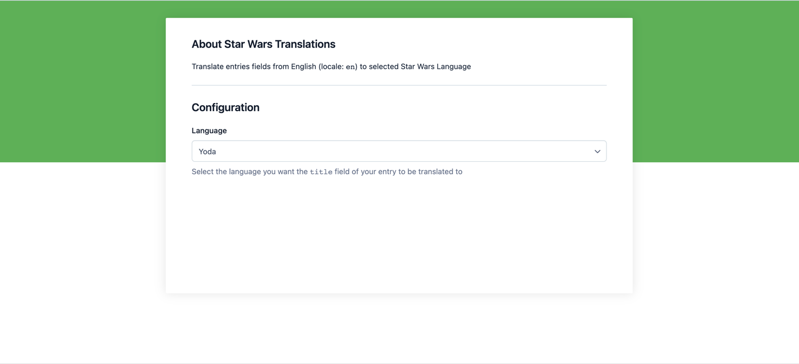
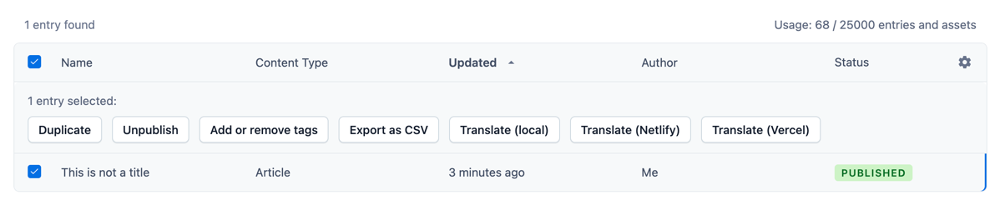
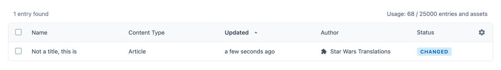
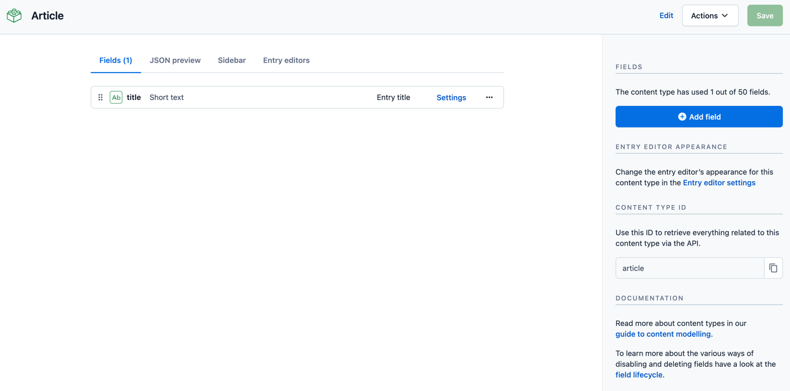
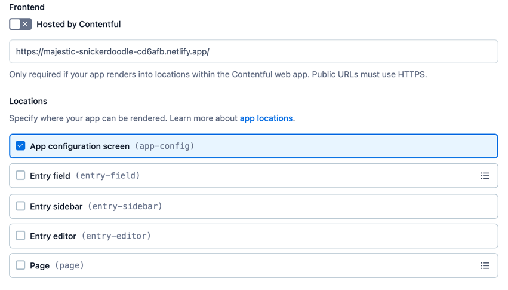
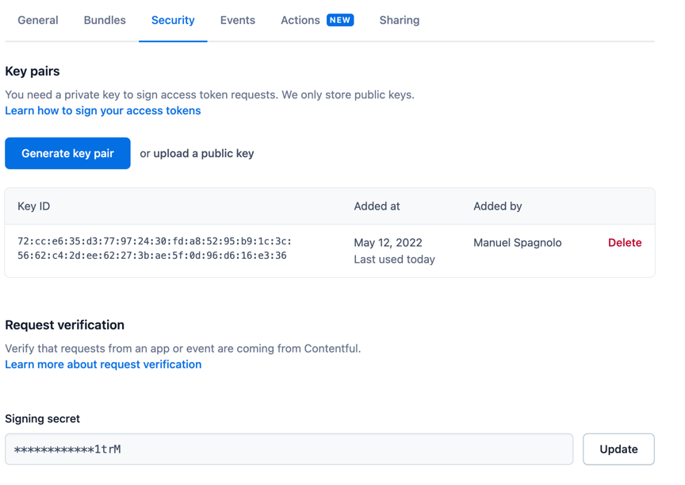
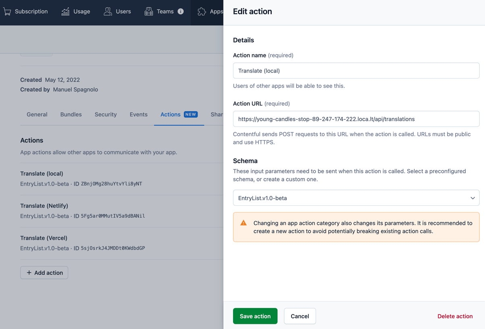

App Actions Example
===

# Introduction

App Actions are a new concept coming to the App Framework soon. At its core, app actions are very simple: They are a named endpoint in the backend of your app. However, their declarative, composable nature will allow them to be an incredibly useful tool in the Contentful platform. In the future, app actions will be able to:

* Extend our upcoming Workflows capabilities with apps
* Extend our UI in a declarative way
* Be a player in the automation story of Contentful

App Actions utilize existing features of the App Framework, such as being secured through [Request Verification](https://www.contentful.com/developers/docs/extensibility/app-framework/request-verification/) and being able to access content using [App Identities](https://www.contentful.com/developers/docs/extensibility/app-framework/app-identity/).

This example outlines how these pieces work together.

You can find more information 
[here](https://www.contentful.com/developers/docs/references/content-management-api/#/reference/app-actions).

# About this Example

Here we are showcasing how to build and host an App Action. In this example we are going to use the 
[Fun Translations API](https://funtranslations.com/) in order to asynchronously translate the `title` field of your 
entries into Star Wars languages.

The core of the implementation lies in [`api/translations.ts`](src/pages/api/translations.ts).

If you want to test it out before diving in the code, you can install the app here

[](https://app.contentful.com/deeplink?link=apps&id=Dcc7QJVP4zGCTcPwGoeCx)

> **Note**
> 
> The linked app is meant as a preview. Maintenance is not planned, and it can break unexpectedly (for example, 
> limits for Fun Translation API are shared among all the users of this app). Please follow the "Setup" steps, if you 
> plan to bring a similar setup in production.

_1. Choosing the language for translation (default to `mandalorian`)_


_2. Triggering the translation_


_3. Translated content_


## Setup

The application is a [NextJS](https://nextjs.org/) web application that can be deployed on either Vercel or Netlify.

### Entry Setup

You only need entries with a `title` field. This is an example content type setup:


### App Setup

To run an app you would need to have an App Definition with App Config location enabled



with a key pair (for generating an App Token) and a signing secret (to trigger secure App Actions)



with App Actions of type Entry List, pointing to the hosting address of your app



> **Note**
> 
> If you want to run the app locally, you will need a publicly available HTTPS URL for your
> backend endpoint. You can use tools such as [ngrok](https://ngrok.com/) or 
> [localtunnel](https://localtunnel.github.io/www/) for that.

## Deployment

Make sure your environment is ready. Check out [`.env.example`](./.env.example) to see what variables
are required to run this example.

### Vercel

1. Create a vercel project
2. Install [vercel cli](https://vercel.com/docs/cli) and login
3. Run `npm run deploy:vercel` and select the project you created earlier

> **Note**
> 
> You may need to create the project in advance or follow the CLI guide

### Netlify

1. Install [NextJS plugin](https://www.netlify.com/with/nextjs/) in your Netlify project 
2. Install [netlify cli](https://cli.netlify.com/)
3. Run `npm run deploy:netlify` and select the project you set up before

## Run Locally

```shell
$ npm start
```

The app will run on `http://localhost:3000`.