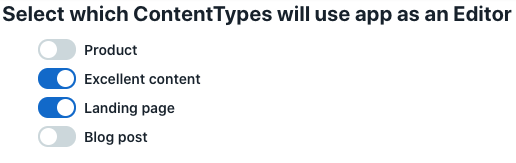

# Assigning an app to Content Types

We recommend using Target State to assign apps to specific content types in your app's config location. Doing this simplifies the process of installing an app.
The code in [set-editors.tsx](./set-editors.tsx) offers an example of how to use Target State to
enable an app for the EntryEditor location of selected content types.

This example can be adapted to suit your app's needs. For example, it could be changed
to
* Assign the app to the Sidebar location
* Show only certain content types depending on some criteria
* Assign an app to certain fields of a content type

## More information
Please see [our detailed Target State documentation](https://www.contentful.com/developers/docs/extensibility/app-framework/target-state/) for more details on how to use Target State.

