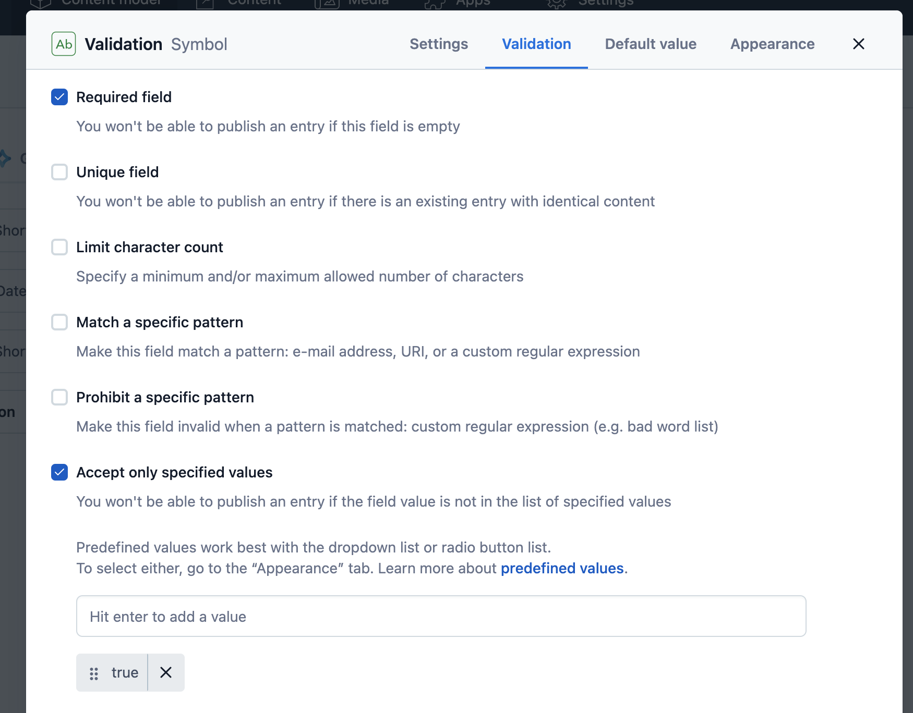
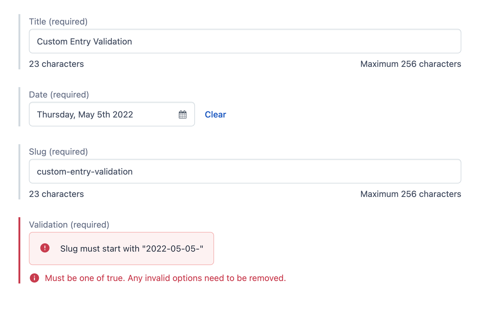
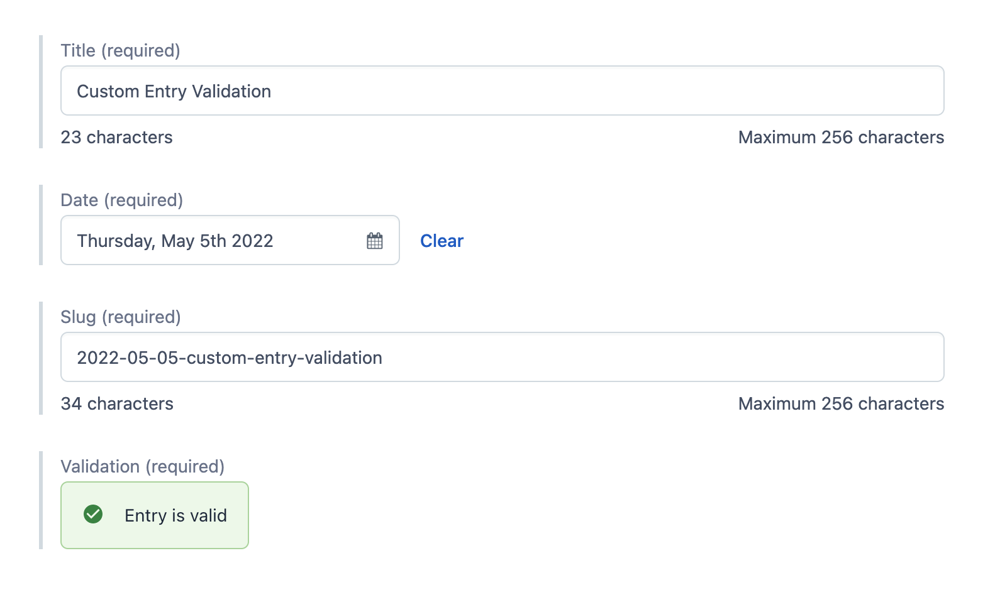

# Custom Entry Validation

When accessing data via Contentful it is important that the consumer can expect certain values and shapes of the structured data. For that reason, Contentful provides built-in entry validation. When creating a content type, each field can have a set of validations that are checked against while editing the entry. These validations are run while editing the entry in the Contentful Web App but also when updating an entry via the CMA. The built-in validations cover the most popular use cases but can never do any domain-specific checks a user might require. In addition to that, these validations are scoped to a specific field. That way, validations can never include the values of multiple fields.

This example shows how a custom app can be used to build a custom entry validation.

## Problem description

Our example content type has three fields:

- Title (Short text)
- Date (Date only)
- Slug (Short text)

Before we publish an entry of that content type, we want to make sure the slug has the correct format. The slug should always be prefixed with the current date. On the day of writing this text that would mean the slug has to start with `2022-05-20-`. A potential final slug could be `2022-05-20-custom-validation`.

## How to prevent publishing

Publishing can only ever be prevented by

- not having enough permissions,
- an unresolved Task, or
- the entry not being valid.

Both approaches can be used to solve our issue e.g. we can use our custom App to add a tag "Invalid" to the entry which then blocks publishing via a custom role.

This example uses the second approach where depending on the custom validation, we update a value of the entry to make a built-in validation fail or succeed. For that reason, the content type needs to be extended by an additional field `validation` of type "Short text". Via the Validation tab, we can ensure the entry can only ever get published when the `validation` field has the value `"true"`. That way, our custom app only needs to update that fields value depending on the custom validation.

To ensure our app is rendered while editing the entry, it has to be assigned to the field via the Appearance tab.

## Our app

> The app can be cloned locally by running `npx create-contentful-app --example custom-validation`

The app itself can be built in many different ways. The approach taken in this example has the goal to be easy to extend for other use cases and more complex content types.

When the Field app renders, it listens to any change (`sys`, `fields`, `metadata`) of the entry and creates an object of the full entry. Now, the custom validation logic can access every single field to determine whether the entry is valid or not. If the entry is not valid, the app calls `sdk.field.setValue('false')` which updates the field to an invalid state, and publishing is blocked. Once all issues are resolved, the app runs `sdk.field.setValue('true')`.

As we are building custom validation logic, we cannot rely on Contentful's built-in way of showing validation errors. Therefore, it is important to give hints to the current editor, that fields are currently in the wrong shape. This can be either done by rendering a list of error messages and/or by calling `sdk.entry.fields[...].getForLocale(...).setInvalid(true)` to highlight the error state of a specific field.

## Result

## Caveats

- The validation runs in the web app and therefore invalid entries can still be persisted via the CMA
- The entry has an additional field `validation` which is delivered to the users via the CDN
- For simplicity reasons, this example doesn't support localized fields
