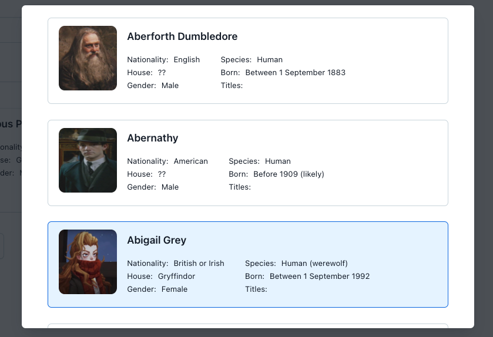
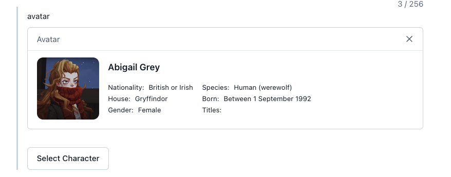
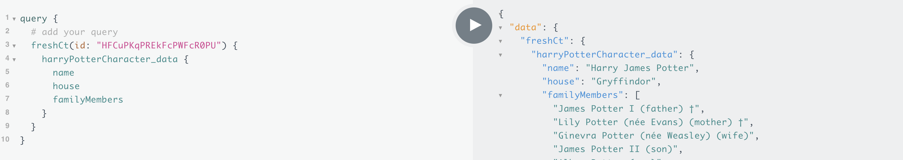

# Function - PotterDB
This is an example of a function that uses the PotterDB REST API to enrich
entries with data from the Harry Potter universe. Even though PotterDB has a GraphQL API
itself, we use the REST API to showcase how to potentially wrap any API.

This project was bootstrapped with [Create Contentful App](https://github.com/contentful/create-contentful-app).

## How to use

Execute create-contentful-app with npm, npx or yarn to bootstrap the example:

```bash
# npx
npx create-contentful-app --example function-potterdb-rest-api

```

## Available Scripts

In the project directory, you can run:

#### `npm start`

Creates or updates your app definition in Contentful, and runs the app in development mode.
Open your app to view it in the browser.

The page will reload if you make edits.
You will also see any lint errors in the console.

#### `npm run build`

Builds the app for production to the `build` folder.
It correctly bundles React in production mode and optimizes the build for the best performance.

The build is minified and the filenames include the hashes.
Your app is ready to be deployed!

#### `npm run upload`

Uploads the build folder to contentful and creates a bundle that is automatically activated.
The command guides you through the deployment process and asks for all required arguments.
Read [here](https://www.contentful.com/developers/docs/extensibility/app-framework/create-contentful-app/#deploy-with-contentful) for more information about the deployment process.

#### `npm run upload-ci`

Similar to `npm run upload` it will upload your app to contentful and activate it. The only difference is  
that with this command all required arguments are read from the environment variables, for example when you add
the upload command to your CI pipeline.

For this command to work, the following environment variables must be set:

- `CONTENTFUL_ORG_ID` - The ID of your organization
- `CONTENTFUL_APP_DEF_ID` - The ID of the app to which to add the bundle
- `CONTENTFUL_ACCESS_TOKEN` - A personal [access token](https://www.contentful.com/developers/docs/references/content-management-api/#/reference/personal-access-tokens)

## Understanding this example 🪄

We can divide the important areas to understand in two parts: **Visual components** and **Functions**

### Visual components: Locations

The visual components will render on the contentful side as widgets, 
and will allow the web app users to configure the content that they wish to orchestrate from 3rd party API's, in this example PotterDB.

This app example will render in two locations: `Dialog` and `Field`

### Dialog



The `Dialog` is the component that will be render when we open the Modal to select the PotterDB Characters.
This component makes use a of custom hook **useCharacters** to fetch a list of characters and render them with **Forma36** components.

### Field 



Once the character is selected We will update the entry field value with the slug of the selected character, which is the value that we will use later to resolve the content on delivery with **Functions**, and finally we will render the selected character with an EntryBox in the location `Field` in entry editor.


### Functions ✨

The main take away from this whole example, is to show that **you can add any REST response into your GraphQL query tree**,
you can take all the advantages of our graphQL API and append content from any external REST API into GraphQL using [Yoga](https://github.com/dotansimha/graphql-yoga).


In order to make Yoga work you need to provide a type definition and the query resolvers.

**Type Definition**

```js
const typeDefs = `
type Character {
  slug: String!
  name: String
  nationality: String
  image: String
  house: String
  wiki: String
  species: String
  gender: String
  aliasNames: [String!]
  familyMembers: [String!]
  titles: [String!]
}

type Query {
  character(slug: String!): Character
}`;
```

**Resolvers**

```js

const resolvers = {
    Query: {
      character: async (_parent, { slug }, _context) => {
        const response = await fetch(`https://api.potterdb.com/v1/characters/${slug}`);

        if (!response.ok) {
          throw new GraphQLError(`PotterDB returned a non-200 status code: ${response.status}`);
        }

        const character = await response.json();
        const {
          name,
          alias_names: aliasNames,
          family_members: familyMembers,
          house,
          image,
          titles,
          wiki,
        } = character.data.attributes;

        return {
          slug,
          name,
          aliasNames,
          familyMembers,
          house,
          image,
          titles,
          wiki,
        };
      },
    },
  }

```

Then we create the GraphQL Schema.

```js
const schema = createSchema({
  typeDefs,
  resolvers
  })

  const yoga = createYoga({ schema, graphiql: false });
```

In the `queryHandler` function we grab the request event, we take the arguments needed to execute our query, in our example this will be the `slug` of the PotterDB character, which value is stored in the entry field, and then we prepare the request and execute it with Yoga.

```js
const queryHandler: EventHandler<FunctionTypeEnum.GraphqlQuery> = async (event, context) => {
  const { query, operationName, variables } = event;
  const body = JSON.stringify({
    query,
    operationName,
    variables,
  });

  const request = {
    body,
    method: 'post',
    headers: {
      accept: 'application/graphql-response+json',
      'content-type': 'application/json',
    },
  };

  const response = await yoga.fetch('http://this-does-not-matter.com/graphql', request, context);

  if (response.type !== 'default') {
    throw new Error('Unsupported GraphQL result type');
  }

  return response.json();
};

```

Now the result will be stitched into our GraphQL response in the Content Delivery API (CDA).




An additional information is that contentful knows where your functions are by reading the `contentful-app-manifest.json`, if you want to have more than one function running in your app, you need to include them there.


## Libraries to use

To make your app look and feel like Contentful use the following libraries:

- [Forma 36](https://f36.contentful.com/) – Contentful's design system
- [Contentful Field Editors](https://www.contentful.com/developers/docs/extensibility/field-editors/) – Contentful's field editor React components

## Using the `contentful-management` SDK

In the default create contentful app output, a contentful management client is
passed into each location. This can be used to interact with Contentful's
management API. For example

```js
// Use the client
cma.locale.getMany({}).then((locales) => console.log(locales));
```

Visit the [`contentful-management` documentation](https://www.contentful.com/developers/docs/extensibility/app-framework/sdk/#using-the-contentful-management-library)
to find out more.

## Learn More

[Read more](https://www.contentful.com/developers/docs/extensibility/app-framework/create-contentful-app/) and check out the video on how to use the CLI.

Create Contentful App uses [Create React App](https://create-react-app.dev/). You can learn more in the [Create React App documentation](https://facebook.github.io/create-react-app/docs/getting-started) and how to further customize your app.