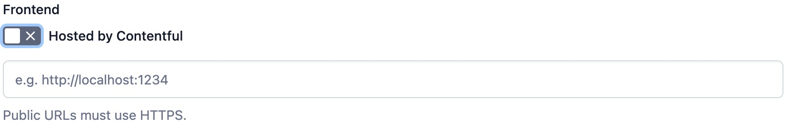

# Delivery Function mock.shop tutorial
In this tutorial you will lean how to integrate the mock.shop API into your editorial and delivery workflows by using delivery functions and the App framework. Delivery Functions run on Contentful's infrastructure and provide you a powerful way to integrate external content into your Content Graph. 

## Creating a custom app
Delivery Functions are part of Contentful's Apps. To be able to create the delivery function we have to create a custom App. For that go to the Contentful  web -> Organisational settings -> Apps (in the top menu bar) and click on Create app. 

Next we have to configure the app itself. Under the App settings general tab change the app *name* to "Mock Shop Tutorial", `disable` *hosted by contentful* and enter http://localhost:3000` as a URL where the app is hosted for now.

