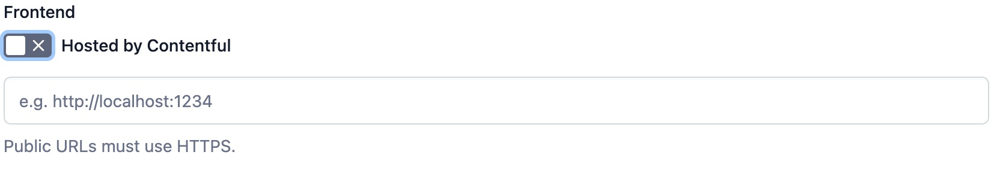
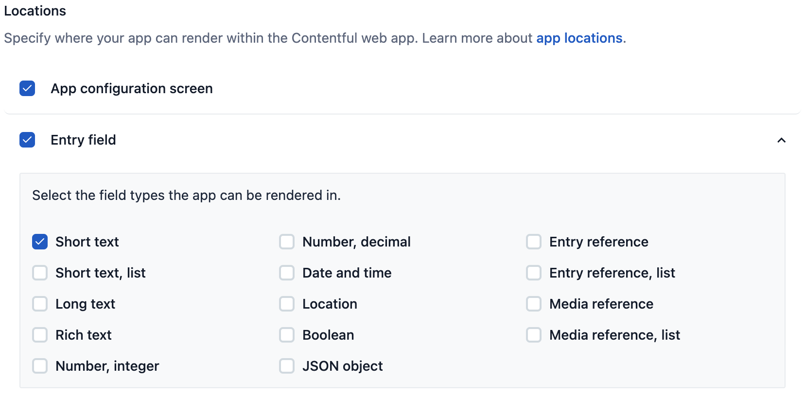
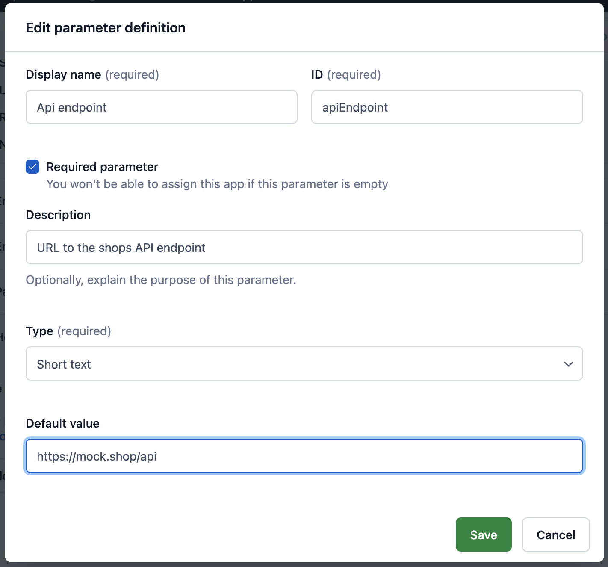
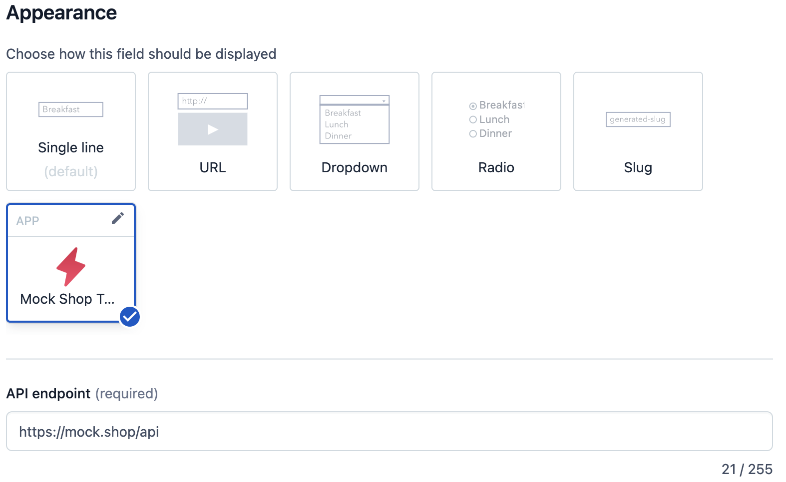
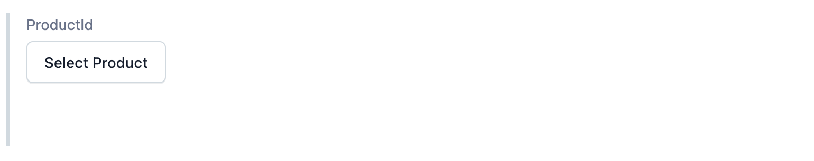
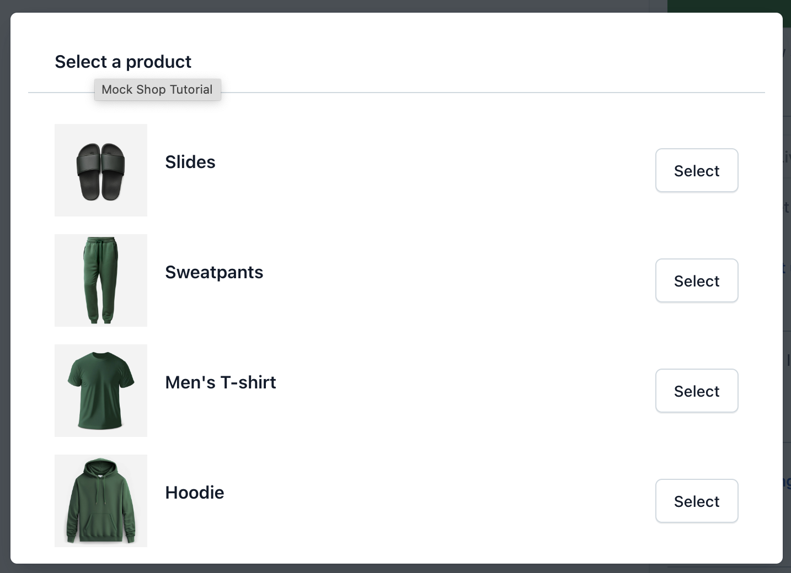
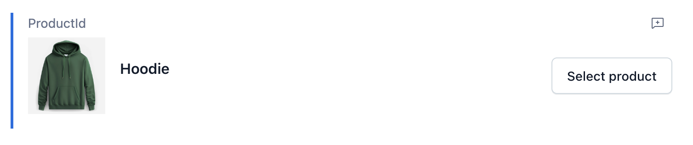
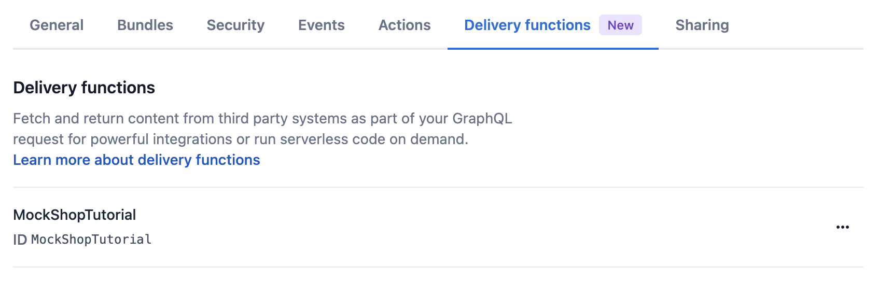

# Tutorial: Integrating the mock.shop API with Delivery Functions in Contentful
Welcome to the Delivery Function mock.shop tutorial! In this step-by-step guide, you will learn how to seamlessly integrate the mock.shop API into your editorial and delivery workflows using delivery functions and Contentful's App framework. Delivery functions are powerful tools that operate on Contentful's infrastructure and enable the integration of external content into your Content Graph. 

## Creating a custom app definition
Delivery Functions are part of Contentful's Apps. We need to first set up a custom app. Follow these steps:

1. Go to the Contentful web interface.
2. Navigate to Organizational settings.
3. In the top menu bar, click on "Apps."
4. Select "Create app."
5. Now, configure the app settings as follows:

Now, configure the app settings as follows:

* Change the app name to "Mock Shop Tutorial."
* Disable the "hosted by Contentful" option.
* Set the URL where the app will be hosted for now to "http://localhost:3000."



As we want to resolve products on a field check *Entry field* and as filed type short check *text* as we are going to store the product id into the field. Also check *App configuration screen* as we want to provide some basic app configuration.



The next step is to configure the "Instance Parameter settings." Here, you can define fields that store parameters for each app installation. In this example, we will make the mock.shop API endpoint configurable within the delivery function. To do this, follow these steps:

* Click on "Add an instance parameter definition."
* Set the "Display name" to "Api endpoint" (the ID will be generated automatically).
* Check the "Required parameter" checkbox.
* Choose the "Type" as "Short text" and define a default value as "https://mock.shop/api."
* Click "Save" to store the parameter.
* Your custom app is now configured. As a final step, click "Save" to persist the app configuration.



Your custom app is now configured. As a final step, click "Save" to persist the app configuration.

## Creating the mock.shop custom app
The next step is to implement the app responsible for rendering the product in the entry editor. Open any terminal and run the following command:

```
$ npx @contentful/create-contentful-app@latest \
	-e hosted-delivery-function-mock-shop
```

This will generate all the code needed for the app. Let's go through the code and see what is what. The `src` folder contains all the code to render the custom app into the Contentful's web app and the. The entry point of the app is the `<App />` component in `.src/App.tsx` It is responsible to to render the correct component into the web apps predefined locations as defined in `ComponentLocationSettings `.

```
const ComponentLocationSettings = {
  [locations.LOCATION_APP_CONFIG]: ConfigScreen,
  [locations.LOCATION_ENTRY_FIELD]: Field,
  [locations.LOCATION_DIALOG]: Dialog,
  [locations.LOCATION_HOME]: Home,
};
```

Next we have all the location components in `./src/locations`:

* `ConfigScreen`: Renders the configuration screen to setup the shops API endpoint.
* `Field`: Renders the product picker where we later can select product.
* `Dialog`: Renders a dialog containing all the products which can be selected
* `Home`: render the home screen of the app

The `./src/hooks` directory contains hooks to fetch products for the product picker. And Finally `./src/components` holds basic view components to render the products.

If you want to learn more about custom apps, refer to the following resources:

* [The App Framework course](https://www.contentful.com/developers/videos/app-framework-course/#understanding-the-appdefinition-and-appinstallation)
* [Create a configuration screen](https://www.contentful.com/developers/docs/extensibility/app-framework/app-configuration/)

## Running and installing the app
Now that all the code is in place from example template we have to run and install the app. To run the app in locally execute:

```
$ npm install # if packages are not allaready instaled
$ npm run start # will start the local development server 
```

Next install the app. Go to your space and install the app from *Apps* (top menu) -> *Custom Apps*. After clicking *install* on the three dotted icon of your app you have to grant access for your space the app will be installed in.

After that you will see the configuration screen which is rendert by `<ConfigScreen />` component. Put in the `https://mock.shop/api` as the API endpoint where we want to resolve products from and hit the *Save* button.

[App configuration screen](./img/app-config-screen.png)

Your app is now installed and configured.

To see the app in action go to your Content Model and create a new Content Type called `Product`. Ddd one field as *Text field* and name it `Product Id`. After clicking *Add and configure* go to the *Appearance* section and choose to display the filed with the "Mock Shop Tutorial" app. Click *Confirm*.



Next, add a new entry with our previously created Content Type *Product*. Instead of a plain text field we get our app rendered were we can select a product from the mock.shop API. 



Click on *Select Product* to open the product selection. 



Choose any product from the list and click "Select" to assign it to the entry.



Publish the entry by clicking "Publish." When you request the entry, it will contain the mock.shop product ID.

```
$ curl 'https://api.contentful.com/spaces/${SPACE_ID}/entries/${ENTRY_ID}' \
  -H "Authorization: Bearer ${AUTH_TOKEN}" | gq '.fields'

{
  "productId": {
    "en-US": "gid://shopify/Product/7982904639510"
  }
}

```

This response contains only the mock.shop product ID, and to retrieve the actual product data, we would typically have to make an additional request to the mock.shop API. Rather than fetching this data on the client side or through a dedicated backend for frontends, we can streamline the process by using a delivery function with Contentful's GraphQL API to seamlessly integrate the product data directly into the content graph.

# Creating and uploading the Delivery Function
Fortunately, we already have all the necessary code to handle product data resolution in the delivery process. Now, let's examine the code generated in ./delivery-functions/mockShop.ts. To start, we'll explore the primary entry point of the delivery function, which is the `handler` function:

```
export const handler: EventHandler = (event, context) => {
  if (event.type === 'graphql.field.mapping') {
    return fieldMappingHandler(event, context);
  }

  if (event.type === 'graphql.query') {
    return queryHandler(event, context);
  }

  throw new Error('Unknown Event');
};
```

The handler will be called for two specific events `graphql.field.mapping` and `graphql.query`. The `graphql.field.mapping` expects a mapping which describes how your content model is connected to the external API. The `graphql.query`  event will be triggered when data is requested. This event also includes the introspection request to retrieve the schema of the external GraphQL API.
Additionally, context data is passed along, including app installation parameters like apiEndpoint, which was configured with the app.

For each event we have implemented dedicated functions. Let's start with the `fieldMappingHandler`:

```
const fieldMappingHandler: EventHandler<'graphql.field.mapping'> = (event) => {
  const fields = event.fields.map(({ contentTypeId, field }) => {
    return {
      contentTypeId,
      fieldId: field.id,
      graphQLOutputType: 'Product',
      graphQLQueryField: 'product',
      graphQLQueryArguments: { id: '' },
    };
  });

  return {
    namespace: 'MockShopTutorial',
    fields,
  };
};
```

The field mapping function returns an object describing how the mock.shop API is connected to your content type.

* `fields`: Since you can assign multiple fields per content type to the delivery function, this is represented as an array.
	* `contentTypeId`: The ID of the content type you want to resolve data for, which, in our case, is the previously created "Product."
	* `fieldId`: The ID of the field where the content reference is stored.
	* `graphQLOutputType`: The GraphQL type that the resolved data belongs to. In this case, we use the "Product" type provided by the mock.shop API.
	* `graphQLQueryField`: The field of the mock.shop API from which we want to retrieve the product data.
	* `graphQLQueryArguments`: Any arguments you want to supply to the query. Empty values indicate that the value of the field should be used.
* `namespace`: This is manly used to avoid schema collision between GraphQL schemas.

Now lets have a look at the `queryHandler`:

```
const queryHandler: EventHandler<'graphql.query'> = async (event, context) => {
  const { apiEndpoint } = context.appInstallationParameters;
  const response = await fetch(apiEndpoint, {
    body: JSON.stringify({
      query: event.query,
      operationName: event.operationName,
      variables: event.variables,
    }),
    method: 'POST',
    headers: { Accept: 'application/json', 'content-type': 'application/json' },
  });

  return response.json();
};
```

In this function, we essentially proxy the query to the mock.shop API. First, we extract the apiEndpoint from the context.appInstallationParameters. Next, we make the actual request to the mock.shop API. All the parameters required to submit the GraphQL request are contained in the event object and passed as a body to the fetch function. This is similar to a regular GraphQL request you would make without a GraphQL library. Finally, we return the retrieved response, which will be included in the request to Contentful's API.

With all the code in place, we can now upload the delivery function and test it. To upload the code, we need to generate a [Content Management API (CMA) Access Token](https://www.contentful.com/developers/docs/references/content-management-api/#/reference/access-tokens), obtain the organization ID, the app definition ID, and add them to our environment variables.

```
# .env
export CONTENTFUL_ACCESS_TOKEN=...
export CONTENTFUL_APP_DEF_ID=...
export CONTENTFUL_ORG_ID=...
```

You can find the organization ID in your Organization settings under "Organization information," and the app definition ID under your "Apps". After sourcing the environment variables, build the app and delivery function, and upload the bundles.

```
$ npm run build # compiles all the code
$ npm run upload # upload the app code so we don't need the local server anymore
$ npm run upload-ci # uploads the delivery function
```

Now, when you check the app details of your tutorial app, you'll see on the "General" tab that your app bundle has been uploaded.

 

Under the "Delivery functions" tab, you'll also see that the delivery function has been uploaded.



To be able to resolve products through Contenful's GraphQL API in delivery we have to enable this on the field. Navigate to you *Content model* and click the *Product* content type. Edit the *ProductId* field. Scroll to the appearance settings were we now can see a *‌Resolve content on delivery* check box. Check the checkbox, confirm your changes and click *Save*. Now we are able to retrieve product information through a single GraphQL request. 

With "Resolve content on delivery" enabled, the field where it's activated will be extended with a new field named after the field assigned to the delivery function and has a `_data` prefix. In our case, it's `productId_data`. You can write the following query to request product data through the Contentful GraphQL API:

```
query {
	  productCollection {
	    items {
	      productId_data {
        	id title
	      }
	    }
	  }
	}
```

Execute the query to check if you've configured everything correctly:

```
curl -X POST 'https://graphql.contentful.com/content/v1/spaces/${SPACE_ID}/environments/master' \
  -H "Content-Type: application/json" \
  -H "Authorization: Bearer ${CONTENT_PREVIEW_API_TOKEN}" \
  -d '{"query": " query { productCollection { items { productId_data { id title }}}}"}'
```

The response will now include product information retrieved from the mock.shop API:

```
{
  "data": {
    "productCollection": {
      "items": [
        {
          "productId_data": {
            "id": "gid://shopify/Product/7982904639510",
            "title": "Hoodie"
          }
        }
      ]
    }
  }
}
```

In conclusion, this tutorial has guided you through the process of seamlessly integrating the mock.shop API into your editorial and delivery workflows using Contentful's Delivery functions and App Framework. You've learned how to create a custom app definition, configure delivery functions, and deploy the necessary code to resolve product data efficiently.

By leveraging Contentful's GraphQL API and a dedicated delivery function, you can effortlessly retrieve product information directly into your content graph, streamlining the content integration.